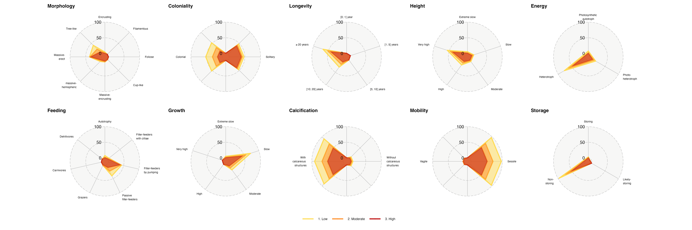
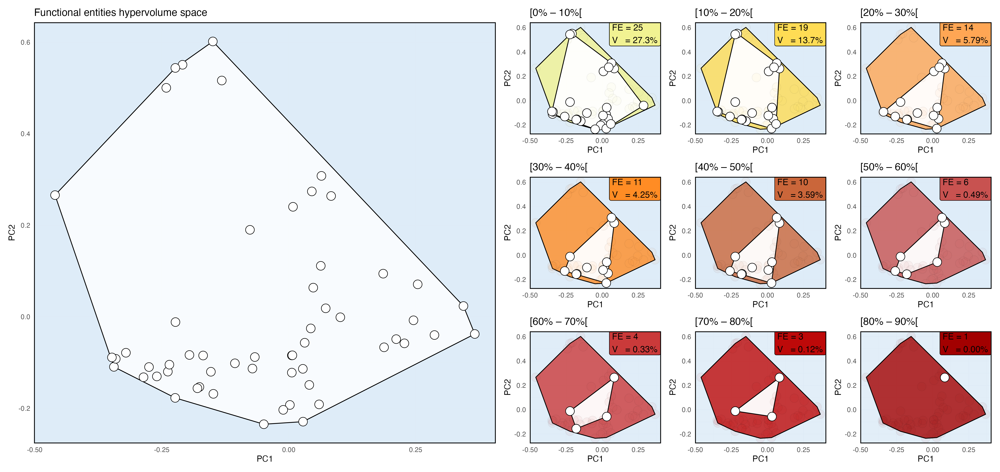

```{=html}
<style type="text/css">
.main-container {
  max-width: 700px;
  margin-left: auto;
  margin-right: auto}
body {
  text-align: justify}
</style>
```
## Highlights

1.  Disproportionate collection effort information with *Pinna nobilis* (27% of the whole dataset representing 569 mortality records). Almost all mortality records accounting for *P. nobilis* are considered severe (i.e., 91%) and 49% of the severe mortality records (i.e., 517 observations) focused on *P. nobilis*.

2.  The MMEs have impaired a total of 137 benthic species. It represents, in terms of functional entities, not less than 91 groups of species. Some traits regarding 11 species still need to be clarified. 21 FEs correspond to at least two species; 70 FEs are single-species groups.

3.  The amount of FEs affected within a 1° cell is spatially sparse.

4.  Species being/having

    1.  massive--erect form,

    2.  solitary behaviour,

    3.  a very high longevity,

    4.  very large,

    5.  heterotrophs,

    6.  filters-feeders,

    7.  slow-growing,

    8.  calcifying,

    9.  sessile and

    10. non-blue-carbon storing strategy were the most impaired by the MMEs during the last decades.

5.  The functional hypervolume is significantly decreasing according to the damage severity.

```{r – Set the environment 💻 , echo=FALSE, include=FALSE, warning=FALSE}
options(warn = -1)

## Packages
library(rnaturalearthdata)  
library(rnaturalearth) 
library(circlepackeR)
library(googledrive)
library(hrbrthemes) 
library(kableExtra)
library(tidyverse) 
library(data.tree)
library(ggspatial) 
library(patchwork)
library(networkD3)
library(sfheaders)
library(ggradar)
library(mapdata) 
library(leaflet) 
library(viridis) 
library(plotly)
library(readxl) 
library(scales) 
library(rgeos)
library(rgdal)
library(mFD)
library(sf) 

## Functions and shapefiles
`%notin%` <- Negate(`%in%`)
world     <- ne_countries(scale = "medium", returnclass = "sf")

## Download datasets from Google Drive
# drive_auth(email = gargle::gargle_oauth_email(),
#            scopes = "https://www.googleapis.com/auth/drive",
#            cache = gargle::gargle_oauth_cache(),
#            use_oob = gargle::gargle_oob_default())

# drive_download(file = "MED_MME_Review/functional_traits/species_traits",
#                path = "Data/species_traits", overwrite = T, type = "xlsx")
# drive_download(file = "MED_MME_Review/MME-Review data",
#                path = "Data/MME-Review data", overwrite = T, type = "xlsx")

## Load Datasets
setwd("..")
### Dataset Functional traits from Nuria Teixido et al.
species_traits <- read_excel("Data/species_traits.xlsx", 
                             sheet = "4_species_traits_clean.vcomplet", 
                             col_types = c("text", "text", "text", "text", "text", "text",
                                           "text", "text", "text", "text", "text", "text",
                                           "text", "text", "text", "text", "text"))


### Dataset Mortality from Massimo Ponti et al.
MME_Merged_data <- read_excel("Data/MME-Review data.xlsx", 
                              sheet = "Merged datasets",
                              col_types = c("numeric", "text"   , "date"   , "date"   ,
                                            "numeric", "text"   , "numeric", "text"   ,
                                            "text"   , "text"   , "text"   , "text"   ,
                                            "numeric", "numeric", "numeric", "numeric",
                                            "text"   , "text"   , "text"   , "text"   ,
                                            "numeric", "text"   , "numeric", "text"   ,
                                            "text"   , "text"   ,
                                            "text"   , "text"   , "numeric", "numeric", 
                                            "numeric", "numeric", "text"   , "numeric", 
                                            "numeric", "text"   , "text"   , "text"   ,
                                            "text"   , "text"   , "text"   , "text"   ,
                                            "text"   , "text"   , "text"   , "numeric",
                                            "numeric", "numeric", "numeric", "text"   ,
                                            "text"   , "text"   ,
                                            "text"   , "text"   , "text"   , "text"   ,
                                            "text"   , "text"   , "text"   , "text"   ,
                                            "text"   , "text"   , "text"   , "text"   ,
                                            "text"))

```

#  {.tabset}

## 1️⃣ Visualize raw data

```{r Figure 1, echo=FALSE, fig.fullwidth=TRUE}
## Set the leaflet parameters
mybins    <- c(1,5,10,25,50,75,80,90,100)
mypalette <- colorBin(palette="YlOrBr", 
                     domain=unique(MME_Merged_data$damaged_percentatge), 
                     na.color="transparent", 
                     bins=mybins)

## First viz all species
Figure_1 <- MME_Merged_data %>% 
leaflet() %>% 
  addTiles() %>% 
  setView(lat = 40, lng = 18 , zoom = 4) %>%
  addProviderTiles("Esri.WorldImagery") %>%
  addCircles(~longitude, ~latitude,  
             fillColor = ~mypalette(damaged_percentatge), 
             fillOpacity = 0.5, color = "white", radius = ~sqrt(damaged_percentatge)*3000, 
             stroke=FALSE, weight = 1,) %>%
  addLegend( pal=mypalette, values=~damaged_percentatge, opacity=0.9, 
             title = "Damaged due to MMEs (%)", 
             position = "topright" )
Figure_1
```

###### [Figure 1.]{.underline} Marine mortality records observed with percentage damage estimated across the Mediterranean Sea within the last 50 years

However, a considerable effort has been focused on *Pinna nobilis* since the last decade [@basso2015; @vázquez-luis2017], and if we discard this information, we might observe a different pattern of mortality events.

```{r Figure 2, echo=FALSE, fig.fullwidth=TRUE}
## First viz w/o P. nobilis
Figure_2 <- MME_Merged_data %>% filter(., species != "Pinna nobilis") %>%
leaflet() %>% 
  addTiles() %>% 
  setView(lat = 40, lng = 18 , zoom = 4) %>%
  addProviderTiles("Esri.WorldImagery") %>%
  addCircles(~longitude, ~latitude,  
             fillColor = ~mypalette(damaged_percentatge), 
             fillOpacity = 0.5, color = "white", radius = ~sqrt(damaged_percentatge)*3000, 
             stroke=FALSE, weight = 1,) %>%
  addLegend( pal=mypalette, values=~damaged_percentatge, opacity=0.9, 
             title = "Damaged due to MMEs (%)", 
             position = "topright" )
Figure_2
```

###### [Figure 2.]{.underline} Marine mortality records observed with percentage damage estimated across the Mediterranean Sea within the last 50 years, discarding *P. nobilis* records

## 2️⃣ Traits definition

In order to get a wider angle instead of quantifying traditional biodiversity loss, we defined for each species, 10 qualitative traits (see **Table 1**) to define a group of species that behave the same into the Mediterranean Sea [@gomezgras_climate_2021; @teixido_functional_2018]. In other words, those groups of species, called 'functional entities' @villéger2011, might ensure the same group of functions into the ecosystem.

```{r analysis, echo = F}
## Define the FE number
### Be sure that we have dataset w/ mortality only
MME_Mortality      <- MME_Merged_data %>% drop_na(., damaged_percentatge)

### Look at the species into the dataset
species_MMEs       <- MME_Mortality %>% arrange(species) %>% distinct(species)
species_Fctl       <- species_traits %>% arrange(species) %>% distinct(species)

### Species mismatch
Species_mismatch   <- species_MMEs$species[species_MMEs$species %notin% species_Fctl$species]

### Remove the 4 missing species so far
MME_Mortality      <- MME_Mortality %>% filter(species %notin% Species_mismatch)

### Set up the data frames and define the FEs richness
tr_cat             <- data.frame(trait_name = colnames(species_traits[3:12]),
                                 trait_type = c("N", "N", "N", "N", "N", "N",
                                                "N", "N", "N", "N"),
                                 fuzzy_name = rep(NA, 10))
sp_tr              <- species_traits %>% column_to_rownames("species") %>% dplyr::select(., 2:11)
sp_tr              <- sp_tr %>% dplyr::mutate_all(as.factor)
sp_to_fe           <- mFD::sp.to.fe(sp_tr = sp_tr, tr_cat = tr_cat) 
fe_nm              <- unique(sp_to_fe$fe_nm) 
# length(fe_nm) # 101 FE

### List of species in each FE
fe_sp              <- list() 
for (k in fe_nm) {
  fe_sp[[k]]       <- names(sp_to_fe$sp_fe[which(sp_to_fe$sp_fe == k)]) }

### Trait values of FE
fe_tr              <- sp_to_fe$fe_tr
```

```{r table 1, echo = F}
data_sp_to_fe      <- sp_to_fe$sp_fe %>% data.frame() %>% 
  rownames_to_column(., var = "Species") %>% rename(., FE = .)
fe_tr              <- fe_tr %>% data.frame() %>% rownames_to_column(., var = "FE") 
colnames(fe_tr)    <- c("FE", "Morphology", "Coloniality", "Longevity", "Height", 
                        "Energy", "Feeding", "Growth", "Calcification", "Mobility",
                        "Storage")
table_sp_and_fe    <- inner_join(data_sp_to_fe, fe_tr, by = "FE") %>% 
  mutate(FE = recode(FE, "fe_1" = "fe_01", "fe_2" = "fe_02", "fe_3" = "fe_03", 
                     "fe_4" = "fe_04", "fe_5" = "fe_05", "fe_6" = "fe_06", 
                     "fe_7" = "fe_07", "fe_8" = "fe_08", "fe_9" = "fe_09")) %>% 
  arrange(FE)
table_sp_and_fe_up <- table_sp_and_fe %>% dplyr::filter(FE %in% c("fe_100", "fe_101"))
table_sp_and_fe_dn <- table_sp_and_fe %>% dplyr::filter(FE %notin% c("fe_100", "fe_101"))
table_sp_and_fe    <- rbind(table_sp_and_fe_dn, table_sp_and_fe_up)
table_sp_and_fe_sankey = table_sp_and_fe

# Higlight where to focus
table_sp_and_fe$Morphology = cell_spec(table_sp_and_fe$Morphology, 
                                       background = ifelse(table_sp_and_fe$Morphology == 0,
                                                      "red", "lightgrey"))
table_sp_and_fe$Coloniality = cell_spec(table_sp_and_fe$Coloniality, 
                                       background = ifelse(table_sp_and_fe$Coloniality == 0,
                                                      "red", "lightgrey"))
table_sp_and_fe$Longevity = cell_spec(table_sp_and_fe$Longevity, 
                                       background = ifelse(table_sp_and_fe$Longevity == 0,
                                                      "red", "lightgrey"))
table_sp_and_fe$Height = cell_spec(table_sp_and_fe$Height, 
                                       background = ifelse(table_sp_and_fe$Height == 0,
                                                      "red", "lightgrey"))
table_sp_and_fe$Energy = cell_spec(table_sp_and_fe$Energy, 
                                       background = ifelse(table_sp_and_fe$Energy == 0,
                                                      "red", "lightgrey"))
table_sp_and_fe$Feeding = cell_spec(table_sp_and_fe$Feeding, 
                                       background = ifelse(table_sp_and_fe$Feeding == 0,
                                                      "red", "lightgrey"))
table_sp_and_fe$Growth = cell_spec(table_sp_and_fe$Growth, 
                                       background = ifelse(table_sp_and_fe$Growth == 0,
                                                      "red", "lightgrey"))
table_sp_and_fe$Calcification = cell_spec(table_sp_and_fe$Calcification, 
                                       background = ifelse(
                                         table_sp_and_fe$Calcification == 0, 
                                         "red", "lightgrey"))
table_sp_and_fe$Mobility = cell_spec(table_sp_and_fe$Mobility, 
                                       background = ifelse(table_sp_and_fe$Mobility == 0,
                                                      "red", "lightgrey"))
table_sp_and_fe$Storage = cell_spec(table_sp_and_fe$Storage, 
                                       background = ifelse(table_sp_and_fe$Storage == 0,
                                                      "red", "lightgrey"))

table_sp_and_fe$Species[table_sp_and_fe$Species == "Haliclona (Halichoclona) fulva"] =
  "Haliclona fulva"
table_sp_and_fe$Species[table_sp_and_fe$Species == "Hymedesmia (Hymedesmia) paupertas"] =
  "Hymedesmia paupertas"

table_sp_and_fe %>% 
  kbl(escape = F) %>%
  kable_paper(full_width = F, position = "left", font_size = 11)
```

###### [Table 1.]{.underline} Functional entities parameters

Note, that here, the Functional entities `#11`, `#26`, `#29`, `#32`, `#33`, `#35`, `#67`, `#68`, `#69` and `#94` are not fully-defined yet! (i.e., presence of the code 0, synonym of *NA*)

To get more details, see this [table](https://docs.google.com/document/d/1MVJtbtWembTGE1Y3Rv9dA3lmj9zOvB298sjfcH82GLc/edit)

## 3️⃣ Traits impairment

```{r Figure 3 old, echo=FALSE, warn = F}

options(dplyr.summarise.inform = FALSE)

## Delineate a grid
# quantile(MME_Mortality$latitude) # 31 to 45
# quantile(MME_Mortality$longitude) # -6 to 36
Lat_grid <- seq(31, 45, 1) 
Lon_grid <- seq(-6, 36, 1)
grid     <- expand.grid(Lat_grid, Lon_grid) %>% data.frame() %>% 
  rename(Lat = Var1, Lon = Var2)

## Add FEs information into the global dataset
function_dataset   <- sp_to_fe$sp_fe %>% data.frame() %>% rownames_to_column(var = "species")
MME_Mortality_grid <- MME_Mortality %>% mutate(lon_rounded_0 = floor(longitude),
                                               lon_rounded_1 = ceiling(longitude), 
                                               lat_rounded_0 = floor(latitude), 
                                               lat_rounded_1 = ceiling(latitude)) %>% 
  inner_join(function_dataset, by = "species") %>% rename(., FEs = .)

## Extract the needed information per cell
### Convert the dataset into a sf object – add the cell information for each row
#### Build empty vectors first
Polygon       <- vector("list", length(MME_Mortality_grid$ID_polygon))
Poly_Coord_df <- vector("list", length(MME_Mortality_grid$ID_polygon))
grid_dataset  <- vector("list", length(MME_Mortality_grid$ID_polygon))
sfc_combined  <- st_sfc()

#### Attribute a cell for each dataset row
for (i in 1:length(MME_Mortality_grid$ID_polygon)) {
  Poly_Coord_df[[i]]      <- data.frame(lon = c(MME_Mortality_grid$lon_rounded_0[i],
                                                MME_Mortality_grid$lon_rounded_1[i]), 
                                        lat = c(MME_Mortality_grid$lat_rounded_0[i],
                                                MME_Mortality_grid$lat_rounded_1[i]))
  Polygon[[i]]            <- Poly_Coord_df[[i]] %>% 
    sf::st_as_sf(coords = c("lon", "lat")) %>% st_bbox() %>% st_as_sfc()
  grid_dataset[[i]]       <- data.frame(MME_Mortality_grid[i,], Polygon[[i]]) }

#### Collect all the information into a single vector
for(i in 1:length(MME_Mortality_grid$ID_polygon)) {
  sfc_combined            <- rbind(sfc_combined, st_as_sf(Polygon[[i]])) }

#### Merge dataset with cell (sf object) information into a single document (sf object)
CRS_used = "+proj=longlat +datum=WGS84 +no_defs +ellps=WGS84 +towgs84=0,0,0"
grid_dataset <- st_as_sf(x = MME_Mortality_grid, coords = c("longitude", "latitude"), 
                         crs = CRS_used)
sfc_combined <- st_as_sf(x = sfc_combined, 
                         wkt = "x", 
                         crs = CRS_used)
grid_dataset <- cbind(sfc_combined, grid_dataset) %>% st_as_sf(wkt = "x")
grid_dataset <- grid_dataset %>% st_set_crs(CRS_used) %>% st_transform(crs=CRS_used)

## Extract statistics
species_affected <- grid_dataset %>% group_by(x, species) %>% summarise(occurence = n()) %>%
  group_by(x) %>% summarise(`number of taxa` = n())
FEs_affected     <- grid_dataset %>% group_by(x, FEs) %>% summarise(occurence = n()) %>%
  group_by(x) %>% summarise(`number of FEs` = n())
dammaged_cell    <- grid_dataset %>% group_by(x, species) %>% 
  summarise(dammaged = mean(damaged_percentatge)) %>% group_by(x) %>% 
  summarise(`% of damage` = mean(dammaged))

## Build the maps with 1° cells

### % of dammaged
Med_dam  <- ggplot(data = world) +
  geom_sf(data = dammaged_cell, shape = 4, aes(fill = `% of damage`), 
          col = "black", size = 5) +
  geom_sf(color = "black", fill = "light grey") +
  scale_fill_gradient(low = "white", high = "red") +
  xlab("Longitude") + ylab("Latitude") +
  coord_sf(xlim = c(-10, 40), ylim = c(30, 45), expand = FALSE) +
  ggtitle("Average percentage of damage") +
  theme(panel.grid.major = element_line(color = gray(.25), linetype = "blank", 
                                        linewidth = 0.2), 
        panel.background = element_rect(fill = "light blue"))

### Number of taxas affected
Med_spp  <- ggplot(data = world) +
  geom_sf(data = species_affected, shape = 4, aes(fill = `number of taxa`), 
          col = "black", size = 5) +
  geom_sf(color = "black", fill = "light grey") +
  scale_fill_gradient(low = "white", high = "red") +
  xlab("Longitude") + ylab("Latitude") +
  coord_sf(xlim = c(-10, 40), ylim = c(30, 45), expand = FALSE) +
  ggtitle("Number of taxa affected") +
  theme(panel.grid.major = element_line(color = gray(.25), 
                                        linetype = "blank", linewidth = 0.2),
        panel.background = element_rect(fill = "light blue"))

Col_FE_gradient_tot <- c("#ffffff", "#f1f292", "#ffdc54", "#ffa654", "#ff8c24", "#ca663a", 
                         "#ca3a3a", "#bd0909", "#88132d", "#883399", "#5f236b", "#36143d", 
                         "#1b0a1e")
Col_FE_gradient_12  <- c("#ffffff", "#f1f292", "#ffdc54", "#ffa654", "#ff8c24", "#ca663a", 
                         "#ca3a3a", "#bd0909", "#88132d", "#883399", "#5f236b", "#1b0a1e")

FEs_affected = FEs_affected %>% arrange(`number of FEs`) %>% 
  mutate(`FEs impacted` = as.factor(`number of FEs`))

### Number of FEs affected
Med_FEs  <- ggplot(data = world) +
  geom_sf(data = FEs_affected, shape = 4, aes(fill = `FEs impacted`), 
          col = "black", size = 5) +
  geom_sf(color = "black", fill = "light grey") +
  scale_fill_manual(values = Col_FE_gradient_12)+
  xlab("Longitude") + ylab("Latitude") +
  coord_sf(xlim = c(-10, 40), ylim = c(30, 45), expand = FALSE) +
  ggtitle("Number of FEs affected") +
  theme(panel.grid.major = element_line(color = gray(.25), linetype = "blank", 
                                        linewidth = 0.2), 
        panel.background = element_rect(fill = "light blue"),
        legend.position = "bottom",
        legend.text = element_text(size=8),
        legend.title = element_text(size=10),
        legend.key.size = unit(0.5, 'cm'),
        plot.margin = unit(c(-4,0,-4,0),"cm"),complete=TRUE) +
  guides(fill = guide_legend(nrow = 1))

```

```{r Figure 3 new, echo=FALSE, warn = F}

mybins    <- seq(1,13,1)
mypalette <- colorBin(palette="YlOrBr", 
                      domain=unique(FEs_affected$number.of.FEs), 
                      na.color="transparent", 
                      bins=mybins)

centroids <- FEs_affected %>% 
  st_centroid() %>% 
  # this is the crs from d, which has no EPSG code:
  st_transform(., '+proj=longlat +ellps=GRS80 +no_defs') %>%
  # since you want the centroids in a second geometry col:
  st_geometry() %>% 
  st_drop_geometry() %>% 
  st_coordinates(centroids) %>% data.frame() %>% 
  rename(Long = X, Lat = Y)

FEs_affected = cbind(FEs_affected, centroids)

Figure_3 <- FEs_affected %>% 
  leaflet() %>% 
  addTiles() %>% 
  setView(lat = 40, lng = 18 , zoom = 4) %>%
  addProviderTiles("Esri.WorldImagery") %>%
  addCircles(~Long, ~Lat,  
             fillColor = ~mypalette(number.of.FEs), 
             fillOpacity = 0.8, color = "white", stroke = F, radius = 30000) %>%
  addLegend( pal=mypalette, values=~number.of.FEs, opacity=0.9, 
             title = "Number FEs affected by MMEs", 
             position = "topright" )
Figure_3
```

###### [Figure 3.]{.underline} Number of Functional Entities (FEs) impaired during the last 50 years by the Mass Mortality Events (MMEs)

### Which species are the most affected?

One way to answer this question is to visualize which traits are the most impacted using a Sankey diagram. In this way, we can disentangle which group or type of species was the most impaired by the previous MMEs.

```{r Figure 4, echo=FALSE, warn = F, out.extra= "100%"}
table_sp_and_fe_sankey <- table_sp_and_fe_sankey %>% rename(species = Species)
Global_dataset <- table_sp_and_fe_sankey %>% data.frame() %>% 
  inner_join(MME_Mortality, by = "species")

## Prepare the dataset to execute a Sankey Diagram
sub_data_1 <- Global_dataset %>% drop_na(damaged_qualitative) %>% 
  group_by(Morphology, damaged_qualitative) %>% 
  summarise(Occurence = n()) %>% 
  rename(Category = Morphology) %>% 
  mutate(Trait = "Morphology") %>% 
  select(Trait, Category, damaged_qualitative, Occurence)
sub_data_2 <- Global_dataset %>% drop_na(damaged_qualitative) %>% 
  group_by(Coloniality, damaged_qualitative) %>% 
  summarise(Occurence = n()) %>% 
  rename(Category = Coloniality) %>% 
  mutate(Trait = "Coloniality") %>% 
  select(Trait, Category, damaged_qualitative, Occurence)
sub_data_3 <- Global_dataset %>% drop_na(damaged_qualitative) %>% 
  group_by(Longevity, damaged_qualitative) %>% 
  summarise(Occurence = n()) %>% 
  rename(Category = Longevity) %>% 
  mutate(Trait = "Longevity") %>% 
  select(Trait, Category, damaged_qualitative, Occurence)
sub_data_4 <- Global_dataset %>% drop_na(damaged_qualitative) %>% 
  group_by(Height, damaged_qualitative) %>% 
  summarise(Occurence = n()) %>% 
  rename(Category = Height) %>% 
  mutate(Trait = "Height") %>% 
  select(Trait, Category, damaged_qualitative, Occurence)
sub_data_5 <- Global_dataset %>% drop_na(damaged_qualitative) %>% 
  group_by(Energy, damaged_qualitative) %>% 
  summarise(Occurence = n()) %>% 
  rename(Category = Energy) %>% 
  mutate(Trait = "Energy") %>% 
  select(Trait, Category, damaged_qualitative, Occurence)
sub_data_6 <- Global_dataset %>% drop_na(damaged_qualitative) %>% 
  group_by(Feeding, damaged_qualitative) %>% 
  summarise(Occurence = n()) %>% 
  rename(Category = Feeding) %>% 
  mutate(Trait = "Feeding") %>% 
  select(Trait, Category, damaged_qualitative, Occurence)
sub_data_7 <- Global_dataset %>% drop_na(damaged_qualitative) %>% 
  group_by(Growth, damaged_qualitative) %>% 
  summarise(Occurence = n()) %>% 
  rename(Category = Growth) %>% 
  mutate(Trait = "Growth") %>% 
  select(Trait, Category, damaged_qualitative, Occurence)
sub_data_8 <- Global_dataset %>% drop_na(damaged_qualitative) %>% 
  group_by(Calcification, damaged_qualitative) %>% 
  summarise(Occurence = n()) %>% 
  rename(Category = Calcification) %>% 
  mutate(Trait = "Calcification") %>% 
  select(Trait, Category, damaged_qualitative, Occurence)
sub_data_9 <- Global_dataset %>% drop_na(damaged_qualitative) %>% 
  group_by(Mobility, damaged_qualitative) %>% 
  summarise(Occurence = n()) %>% 
  rename(Category = Mobility) %>% 
  mutate(Trait = "Mobility") %>% 
  select(Trait, Category, damaged_qualitative, Occurence)
sub_data_10 <- Global_dataset %>% drop_na(damaged_qualitative) %>% 
  group_by(Storage, damaged_qualitative) %>% 
  summarise(Occurence = n()) %>% 
  rename(Category = Storage) %>% 
  mutate(Trait = "Storage") %>% 
  select(Trait, Category, damaged_qualitative, Occurence)

## Sankey dataset first node
Sankey_dataset <- rbind(sub_data_1, sub_data_2, sub_data_3, sub_data_4, sub_data_5,
                        sub_data_6, sub_data_7, sub_data_8, sub_data_9, sub_data_10) %>% 
  mutate(Occurence = round(Occurence/1548, 3)) %>% 
  mutate(Category = paste(Trait, Category, sep = "_"))  %>% 
  mutate(Category = recode(Category, "Calcification_a" = "Non-calcifying",
                                     "Calcification_b" = "Calcifying",
                                     "Coloniality_1"   = "Solitary",
                                     "Coloniality_2"   = "Colonial",
                                     "Energy_1"        = "Autotroph",
                                     "Energy_2"        = "Mixotroph",
                                     "Energy_3"        = "Heterotroph",
                                     "Feeding_a"       = "Photosynthesis",
                                     "Feeding_b"       = "Filter-feeder cilia",
                                     "Feeding_c"       = "Filter-feeder pump",
                                     "Feeding_d"       = "Filter-feeder passive",
                                     "Feeding_e"       = "Grazers",
                                     "Feeding_f"       = "Carnivores",
                                     "Feeding_g"       = "Detritivores",
                                     "Growth_1"        = "Extreme slow",
                                     "Growth_2"        = "Slow",
                                     "Growth_3"        = "Intermediate",
                                     "Growth_4"        = "Fast",
                                     "Growth_5"        = "Extreme fast",
                                     "Height_0"        = "NA",
                                     "Height_1"        = "Very small",
                                     "Height_2"        = "Small",
                                     "Height_3"        = "Medium",
                                     "Height_4"        = "Big",
                                     "Height_5"        = "Very big",
                                     "Longevity_1"     = "≤ 1 year",
                                     "Longevity_2"     = "]1, 5] years",
                                     "Longevity_3"     = "]5, 10] years",
                                     "Longevity_4"     = "]10, 20] years",
                                     "Longevity_5"     = "> 20 years",
                                     "Mobility_a"      = "Sessile",
                                     "Mobility_b"      = "Vagile",
                                     "Morphology_b"    = "Encrusting",
                                     "Morphology_c"    = "Filamentous",
                                     "Morphology_f"    = "Articulated",
                                     "Morphology_h"    = "Branched",
                                     "Morphology_i"    = "Massive-encrusting",
                                     "Morphology_j"    = "Massive-hemispheric",
                                     "Morphology_k"    = "Massive-erect",
                                     "Morphology_l"    = "Tree-like",
                                     "Storage_a"       = "Storing",
                                     "Storage_b"       = "Likely storing",
                                     "Storage_c"       = "Non-storing")) %>% 
  dplyr::filter(., Category != "NA")

Sankey_dataset_traits <- Sankey_dataset %>%
  group_by(Category) %>% 
  summarise(value = sum(Occurence), source = Trait) %>% 
  rename(target = Category) 
Sankey_dataset <- Sankey_dataset %>% 
  select(Category, damaged_qualitative, Occurence) %>% 
  rename(source = Category, target = damaged_qualitative, value = Occurence)
  
Sankey_dataset <- rbind(Sankey_dataset, Sankey_dataset_traits) %>% data.frame() %>%
  distinct() %>% mutate(value = value * 1548)

nodes = data.frame(name= unique(c(Sankey_dataset$source, Sankey_dataset$target)))

Sankey_dataset <- Sankey_dataset %>% 
  mutate(IDsource = match(Sankey_dataset$source, nodes$name)-1,
         IDtarget=match(Sankey_dataset$target, nodes$name)-1) %>% data.frame()

ColourScal ='d3.scaleOrdinal() 
.range(["#92D718","#92D718","#92D718","#92D718","#92D718","#92D718","#92D718","#92D718",
        "#17CA78","#17CA78",
        "#0DEAC5","#0DEAC5","#0DEAC5","#0DEAC5","#0DEAC5",
        "#0DE0EA","#0DE0EA","#0DE0EA","#0DE0EA", 
        "#08ADB5","#08ADB5","#08ADB5",
        "#086EB5","#086EB5","#086EB5","#086EB5","#086EB5",
        "#0A2EB1","#0A2EB1","#0A2EB1","#0A2EB1",
        "#1D039C","#1D039C",
        "#5B06AB","#5B06AB",
        "#850DF7","#850DF7","#850DF7",
        "#0DEAC5","#92D718","#08ADB5","#0DE0EA","#1D039C","#086EB5","#17CA78","#1D039C",
        "#850DF7","#5B06AB","#F7F30D","#F7AD0D","#F72D0D"])'

Figure_4 <- sankeyNetwork(Links = Sankey_dataset, Nodes = nodes,
              Source = "IDsource", Target = "IDtarget",
              Value = "value", NodeID = "name", colourScale = ColourScal , 
              sinksRight = FALSE, nodeWidth = 15, fontSize = 12, 
              nodePadding = 10, iterations = 0, width = 815, height = 700,
              margin = list(right = -120))

Figure_4
```

###### [Figure 4.]{.underline} Traits impairment according to the MMEs damage severity

Some traits are more impacted than others:

-   [**massive erects organisms**]{.underline}\
    592 occurrences with, 22 low-impacted, 21 moderate-impacted, 549 high-impacted\
    *38% from the whole dataset*

-   [**solitary organisms**]{.underline}\
    723 occurrences with, 72 low-impacted, 53 moderate-impacted, 598 high-impacted\
    *47% from the whole dataset*

-   [**very high longevity organisms**]{.underline}\
    1049 occurrences with, 222 low-impacted, 164 moderate-impacted, 663 high-impacted\
    *68% from the whole dataset*

-   [**very large organisms**]{.underline}\
    864 occurrences with, 134 low-impacted, 125 moderate-impacted, 605 high-impacted\
    *56% from the whole dataset*

-   [**heterotrophs**]{.underline}\
    1183 occurrences with, 218 low-impacted, 216 moderate-impacted, 749 high-impacted\
    *76% from the whole dataset*

-   [**filters-feeders**]{.underline} ⚠️\
    1384 occurrences with, 297 low-impacted, 271 moderate-impacted, 816 high-impacted\
    *89% from the whole dataset*

-   [**slow-growing organisms**]{.underline}\
    1108 occurrences with, 219 low-impacted, 189 moderate-impacted, 700 high-impacted\
    *72% from the whole dataset*

-   [**calcifying organisms**]{.underline} ⚠️\
    1408 occurrences with, 331 low-impacted, 282 moderate-impacted, 795 high-impacted\
    *91% from the whole dataset*

-   [**sessile organisms**]{.underline} ⚠️\
    1500 occurrences with, 376 low-impacted, 290 moderate-impacted, 834 high-impacted\
    *97% from the whole dataset*

-   [**non-blue-carbon storing organisms**]{.underline} ⚠️\
    1491 occurrences with, 343 low-impacted, 298 moderate-impacted, 850 high-impacted\
    *96% from the whole dataset*

Another way to look at the data, is using `Circular packing plots`. However, it will not be possible to display it into a paper.

*NB: I did not manage to upload it online.*

```{r Figure 4 alt, echo=FALSE}

# Reformat the data
Circular_Plot_dataset <- rbind(sub_data_1, sub_data_2, sub_data_3, sub_data_4, sub_data_5,
      sub_data_6, sub_data_7, sub_data_8, sub_data_9, sub_data_10) %>% 
  mutate(Category = paste(Trait, Category, sep = "_"))  %>% 
  mutate(Category = recode(Category, "Calcification_a" = "Non-calcifying",
                           "Calcification_b" = "Calcifying",
                           "Coloniality_1"   = "Solitary",
                           "Coloniality_2"   = "Colonial",
                           "Energy_1"        = "Autotroph",
                           "Energy_2"        = "Mixotroph",
                           "Energy_3"        = "Heterotroph",
                           "Feeding_a"       = "Photosynthesis",
                           "Feeding_b"       = "Filter-feeder cilia",
                           "Feeding_c"       = "Filter-feeder pump",
                           "Feeding_d"       = "Filter-feeder passive",
                           "Feeding_e"       = "Grazers",
                           "Feeding_f"       = "Carnivores",
                           "Feeding_g"       = "Detritivores",
                           "Growth_1"        = "Extreme slow",
                           "Growth_2"        = "Slow",
                           "Growth_3"        = "Intermediate",
                           "Growth_4"        = "Fast",
                           "Growth_5"        = "Extreme fast",
                           "Height_0"        = "NA",
                           "Height_1"        = "Very small",
                           "Height_2"        = "Small",
                           "Height_3"        = "Medium",
                           "Height_4"        = "Big",
                           "Height_5"        = "Very big",
                           "Longevity_1"     = "≤ 1 year",
                           "Longevity_2"     = "]1, 5] years",
                           "Longevity_3"     = "]5, 10] years",
                           "Longevity_4"     = "]10, 20] years",
                           "Longevity_5"     = "> 20 years",
                           "Mobility_a"      = "Sessile",
                           "Mobility_b"      = "Vagile",
                           "Morphology_b"    = "Encrusting",
                           "Morphology_c"    = "Filamentous",
                           "Morphology_f"    = "Articulated",
                           "Morphology_h"    = "Branched",
                           "Morphology_i"    = "Massive-encrusting",
                           "Morphology_j"    = "Massive-hemispheric",
                           "Morphology_k"    = "Massive-erect",
                           "Morphology_l"    = "Tree-like",
                           "Storage_a"       = "Storing",
                           "Storage_b"       = "Likely storing",
                           "Storage_c"       = "Non-storing")) %>% 
  dplyr::filter(., Category != "NA") %>% 
  dplyr::select(damaged_qualitative, Trait, Category, Occurence) %>% 
  arrange(damaged_qualitative, Trait)

# Format the data for the package circlepackeR
Circular_Plot_dataset <- data.frame(
  root = rep("root", 112),
  group = Circular_Plot_dataset$damaged_qualitative,
  subgroup = Circular_Plot_dataset$Trait,
  subsubgroup = Circular_Plot_dataset$Category,
  value = Circular_Plot_dataset$Occurence)

# Define the nodes
Circular_Plot_dataset$pathString <- paste("world", Circular_Plot_dataset$group, 
                                          Circular_Plot_dataset$subgroup, 
                                          Circular_Plot_dataset$subsubgroup, sep = "/")

Figure_4_alt <- circlepackeR(as.Node(Circular_Plot_dataset))
```

## 4️⃣️ Traits hypervolume

```{r Figure 5, echo = F, warn = F, message = F}

options(warn = -1)

## Split the dataset into categories
grid_dataset$damaged_qualitative[grid_dataset$damaged_qualitative == "moderate"] = "Moderate"
data_ID_Cell       <- data.frame(x = unique(paste(grid_dataset$lon_rounded_0,
                                                  grid_dataset$lon_rounded_1, 
                                                  grid_dataset$lat_rounded_0,
                                                  grid_dataset$lat_rounded_1, sep = "_")),
                                 ID_Cell = paste("Cell_",
                                                 seq(1, length(unique(grid_dataset$x)), 1),
                                                 sep = ""))
grid_dataset$rect  <- paste(grid_dataset$lon_rounded_0, grid_dataset$lon_rounded_1, 
                            grid_dataset$lat_rounded_0, grid_dataset$lat_rounded_1, sep="_")
grid_dataset       <- merge(data_ID_Cell, grid_dataset, by.x = "x", by.y = "rect")
FE_dataset         <- grid_dataset %>% 
  mutate(ID = paste(grid_dataset$ID_Cell, grid_dataset$damaged_qualitative, sep = "_"))

## Play with mortality rates
FE_matrix          <- FE_dataset %>% group_by(ID, FEs) %>% summarise(occurence = n())
FE_matrix          <- reshape2::acast(FE_matrix, ID~FEs, value.var = "occurence")

### Convert in Presence absence
FE_matrix[is.na(FE_matrix)] <- 0
FE_matrix[FE_matrix > 0]    <- 1

### computing Gower distance between FEs
tr_cat[,1] <- colnames(fe_tr)[-1]
colnames(sp_tr) <- colnames(fe_tr)[-1]
fe_tr <- fe_tr %>% column_to_rownames("FE")
fe_fe_dist <- funct.dist(fe_tr, tr_cat[,-3], metric = "gower")
fe_fspaces <- mFD::quality.fspaces(sp_dist = fe_fe_dist)

### Looking for how many axes
# print(round(fe_fspaces$quality_fspaces,3)) # > 6 dimensions
fe_6D_coord <- fe_fspaces$details_fspaces$sp_pc_coord[,1:6]

### Define the number of mortality occurences
habcat = FE_matrix %>% data.frame() %>% mutate_if(is.character,as.numeric) %>% 
  mutate(cat = sub("^[^_]*_", "", sub("^[^_]*_", "", rownames(FE_matrix)))) %>% 
  group_by(cat) %>% 
  summarise_all(sum)
FEs_cat_dataset = t(habcat) %>% data.frame() %>% janitor::row_to_names(row_number = 1) %>% 
  rownames_to_column(var = "FEs") %>% dplyr::select(-"NA")
colnames(FEs_cat_dataset) <- c("FEs", "Low_mor_occ", "Mod_mor_occ", "Sev_mor_occ") 

## Define the survival rates
grid_dataset$survival_rate <- 100 - grid_dataset$damaged_percentatge
FE_dataset         <- grid_dataset %>% 
  mutate(ID = paste(grid_dataset$ID_Cell, grid_dataset$damaged_qualitative, sep = "_"))
FE_matrix          <- FE_dataset %>% group_by(ID, FEs) %>% 
  summarise(survival_rate = mean(survival_rate))
FE_matrix          <- reshape2::acast(FE_matrix, ID~FEs, value.var = "survival_rate")

### Convert in survival rate matrix
FE_matrix[FE_matrix > 0]    <- 0
FE_matrix[is.na(FE_matrix)] <- 1

### Functional statistics
quadrats_multidimFD <- alpha.fd.multidim(sp_faxes_coord = fe_6D_coord, asb_sp_w = FE_matrix, 
                                         ind_vect = c("fdis", "fide", "fspe", "fori"), 
                                         scaling = TRUE, details_returned = TRUE, 
                                         verbose = FALSE)
quadrats_taxo_hill  <- alpha.fd.hill(asb_sp_w = FE_matrix, 
                                     sp_dist = fe_fe_dist, q = c(0,1), tau = "min",
                                     details_returned = FALSE)
colnames(quadrats_taxo_hill) <- c("FE_richness", "FE_shannon")
quadrats_funct_hill <- alpha.fd.hill(asb_sp_w = FE_matrix, sp_dist = fe_fe_dist, q = 1, 
                                     tau = "min", details_returned = FALSE)

### Merging all diversity indices with specific info
quadrats_biodiv     <- data.frame(Nb_sp = 
                                    quadrats_multidimFD$functional_diversity_indices[,1], 
                                  Impact_damage = sub("^[^_]*_", "", 
                                                      sub("^[^_]*_", "", 
                                                          rownames(quadrats_taxo_hill))),
                                  quadrats_taxo_hill, quadrats_funct_hill,
                                  quadrats_multidimFD$functional_diversity_indices[,-1]) 

### Merge PCoA coord with mortality records
pool_coord          <- quadrats_multidimFD$details$sp_faxes_coord %>% data.frame() %>%
  rownames_to_column(var = "FEs")
FEs_cat_dataset     <- merge(FEs_cat_dataset, pool_coord, by = 'FEs')

### Mortality Presence / Absence
Mortality_PA        <- FE_matrix %>% data.frame() %>% mutate_if(is.character,as.numeric) %>% 
  mutate(cat = quadrats_biodiv$Impact_damage) %>% group_by(cat) %>% 
  summarise_all(min)
Mortality_PA        <- t(Mortality_PA) %>% data.frame() %>% 
  janitor::row_to_names(row_number = 1) %>% 
  rownames_to_column(var = "FEs")

## Final dataset hypervolume
FEs_cat_dataset     <- merge(FEs_cat_dataset, Mortality_PA, by = 'FEs')

## Builds the different datasets layers for the figure
### General convex hull
conv_hull_tot = FEs_cat_dataset %>%  slice(chull(PC1, PC2))

### Low damage
FEs_cat_dataset$Low         <- as.numeric(FEs_cat_dataset$Low)
FEs_cat_dataset$Low_mor_occ <- as.numeric(FEs_cat_dataset$Low_mor_occ)
FEs_cat_dataset$Low_mor_log <- log(FEs_cat_dataset$Low_mor_occ + 1)
FEs_cat_dataset_Low_aliv    <- FEs_cat_dataset %>% filter(Low >  0) %>% 
  dplyr::select(-c(Moderate, Severe, Mod_mor_occ, Sev_mor_occ)) 
FEs_cat_dataset_Low_dead    <- FEs_cat_dataset %>% filter(Low == 0) %>% 
  dplyr::select(-c(Moderate, Severe, Mod_mor_occ, Sev_mor_occ))
conv_hull_low               <- FEs_cat_dataset_Low_aliv %>% slice(chull(PC1, PC2))

### Moderate damage
FEs_cat_dataset$Moderate    <- as.numeric(FEs_cat_dataset$Moderate)
FEs_cat_dataset$Mod_mor_occ <- as.numeric(FEs_cat_dataset$Sev_mor_occ)
FEs_cat_dataset$Mod_mor_log <- log(FEs_cat_dataset$Mod_mor_occ + 1)
FEs_cat_dataset_Mod_aliv    <- FEs_cat_dataset %>% filter(Moderate >  0) %>% 
  dplyr::select(-c(Low, Severe, Low_mor_occ, Sev_mor_occ)) 
FEs_cat_dataset_Mod_dead    <- FEs_cat_dataset %>% filter(Moderate == 0) %>% 
  dplyr::select(-c(Low, Severe, Low_mor_occ, Sev_mor_occ))
conv_hull_mod               <- FEs_cat_dataset_Mod_aliv %>% slice(chull(PC1, PC2))

### Moderate damage
FEs_cat_dataset$Severe      <- as.numeric(FEs_cat_dataset$Severe)
FEs_cat_dataset$Sev_mor_occ <- as.numeric(FEs_cat_dataset$Low_mor_occ)
FEs_cat_dataset$Sev_mor_log <- log(FEs_cat_dataset$Sev_mor_occ + 1)
FEs_cat_dataset_Sev_aliv    <- FEs_cat_dataset %>% filter(Severe >  0) %>% 
  dplyr::select(-c(Low, Moderate, Low_mor_occ, Mod_mor_occ)) 
FEs_cat_dataset_Sev_dead    <- FEs_cat_dataset %>% filter(Severe == 0) %>% 
  dplyr::select(-c(Low, Moderate, Low_mor_occ, Mod_mor_occ))
conv_hull_sev               <- FEs_cat_dataset_Sev_aliv %>% slice(chull(PC1, PC2))

### Hypervolume Figure

Low_hypervolume <- ggplot(data = conv_hull_tot, aes(x = PC1, y = PC2)) +
  geom_rect(aes(xmin = -Inf, xmax = Inf, ymin = -Inf, ymax = Inf), 
            fill = "#deebf7", color = "NA", alpha = 0.5, inherit.aes = F) +
  geom_polygon(alpha = .8, col = "black", fill = "white") +
  geom_polygon(data = conv_hull_low, aes(x = PC1, y = PC2), 
               alpha = .5, col = "black", fill = "yellow") +
  geom_point(data = FEs_cat_dataset_Low_aliv, aes(x = PC1, y = PC2, group = FEs), 
             col = "black", fill = "yellow", size = 3, shape = 21) +
  geom_point(data = FEs_cat_dataset_Low_dead, aes(x = PC1, y = PC2, size = Low_mor_occ, 
                                                  group = FEs), 
             col = "black", fill = "grey", shape = 21, alpha = .4) +
  theme_minimal() + 
  scale_size_continuous(range = c(min(FEs_cat_dataset_Low_dead$Low_mor_log) + 1, 
                                  max(FEs_cat_dataset_Low_dead$Low_mor_log) + 1)) + 
  theme(legend.position = "none") + ggtitle("Low damage (<30%)")

Mod_hypervolume <- ggplot(data = conv_hull_tot, aes(x = PC1, y = PC2)) +
  geom_rect(aes(xmin = -Inf, xmax = Inf, ymin = -Inf, ymax = Inf), 
            fill = "#deebf7", color = "NA", alpha = 0.5, inherit.aes = F) +
  geom_polygon(alpha = .8, col = "black", fill = "white") +
  geom_polygon(data = conv_hull_mod, aes(x = PC1, y = PC2), 
               alpha = .5, col = "black", fill = "orange") +
  geom_point(data = FEs_cat_dataset_Mod_aliv, aes(x = PC1, y = PC2, group = FEs), 
             col = "black", fill = "orange", size = 3, shape = 21) +
  geom_point(data = FEs_cat_dataset_Mod_dead, aes(x = PC1, y = PC2, size = Mod_mor_occ, 
                                                  group = FEs), 
             col = "black", fill = "grey", shape = 21, alpha = .4) +
  theme_minimal() + 
  scale_size_continuous(range = c(min(FEs_cat_dataset_Mod_dead$Mod_mor_log) + 1, 
                                  max(FEs_cat_dataset_Mod_dead$Mod_mor_log) + 1)) + 
  theme(legend.position = "none") + ggtitle("Moderate damage (>30% and <60%)")

Sev_hypervolume <- ggplot(data = conv_hull_tot, aes(x = PC1, y = PC2)) +
  geom_rect(aes(xmin = -Inf, xmax = Inf, ymin = -Inf, ymax = Inf), 
            fill = "#deebf7", color = "NA", alpha = 0.5, inherit.aes = F) +
  geom_polygon(alpha = .8, col = "black", fill = "white") +
  geom_polygon(data = conv_hull_sev, aes(x = PC1, y = PC2), 
               alpha = .5, col = "black", fill = "red") +
  geom_point(data = FEs_cat_dataset_Sev_aliv, aes(x = PC1, y = PC2, group = FEs), 
             col = "black", fill = "red", size = 3, shape = 21) +
  geom_point(data = FEs_cat_dataset_Sev_dead, aes(x = PC1, y = PC2, size = Sev_mor_occ, 
                                                  group = FEs), 
             col = "black", fill = "grey", shape = 21, alpha = .4) +
  theme_minimal() + 
  scale_size_continuous(range = c(min(FEs_cat_dataset_Sev_dead$Sev_mor_log) + 1, 
                                  max(FEs_cat_dataset_Sev_dead$Sev_mor_log) + 1)) + 
  theme(legend.position = "none") + ggtitle("High damage (>60%)")

Figure_5 = Low_hypervolume + Mod_hypervolume + Sev_hypervolume +
  plot_annotation(caption = 'Note: the light grey dots represent affected FEs while colored dots represents non-affected FEs')

ggplotly(Low_hypervolume) %>% layout(hovermode ='FEs')
ggplotly(Mod_hypervolume) %>% layout(hovermode ='FEs')
ggplotly(Sev_hypervolume) %>% layout(hovermode ='FEs')
```

## 5️⃣ Figures selection

```{r figure 1 for RPROC B, echo = F}
mycolors <- c("#f1f292", "#ffdc54", "#ffa654", "#ff8c24", "#ca663a", 
              "#c85250", "#ca3a3a", "#bd0909", "#a20000", "#6f0000")

mybins    <- c(10,20,30,40,50,60,70,80,90,100)
mypalette <- colorBin(palette = mycolors, 
                      domain=unique(MME_Merged_data$damaged_percentatge), 
                      na.color="transparent", 
                      bins=mybins)

## First viz all species
(Figure_1 <- MME_Merged_data %>% 
  leaflet(options = leafletOptions(
    attributionControl=FALSE)) %>% 
  addTiles() %>% 
  setView(lat = 40, lng = 18 , zoom = 4) %>%
  addProviderTiles("Esri.WorldImagery") %>%
  addCircles(~longitude, ~latitude,  
             fillColor = ~mypalette(damaged_percentatge), 
             fillOpacity = 0.5, color = "white", radius = ~sqrt(damaged_percentatge)*4000, 
             stroke=FALSE, weight = 1,) %>%
  addLegend( pal=mypalette, values=~damaged_percentatge, opacity=0.9, 
             title = "Damaged due to MMEs (%)", 
             position = "topright" ))
```

Figure 1: caption



```{r figure 3 for RPROC B, echo = F}
grid_dataset <- grid_dataset %>% 
  dplyr::select(-c(lon_rounded_0, lon_rounded_1, lat_rounded_0, lat_rounded_1, x.y, geometry, x))

# Refine percentage
grid_dataset <- grid_dataset %>% dplyr::filter(damaged_percentatge > 0) # Problem with 0 occurences
grid_dataset$damage_sub_cat <- cut_width(grid_dataset$damaged_percentatge, 10, boundary = 0)

# Refine cumulative – If affected at further level, it'd be affected correspondingly
data_FE_Affected <- table(grid_dataset$damage_sub_cat, grid_dataset$FEs) %>% as.data.frame.matrix() 

{data_FE_Affected[1,]  <- data_FE_Affected[1,] + data_FE_Affected[2,] + data_FE_Affected[3,] +
  data_FE_Affected[4,] + data_FE_Affected[5,] + data_FE_Affected[6,] + data_FE_Affected[7,] +
  data_FE_Affected[8,] + data_FE_Affected[9,] + data_FE_Affected[10,]
data_FE_Affected[2,]  <- data_FE_Affected[2,] + data_FE_Affected[3,] + data_FE_Affected[4,] + 
  data_FE_Affected[5,] + data_FE_Affected[6,] + data_FE_Affected[7,] + data_FE_Affected[8,] + 
  data_FE_Affected[9,] + data_FE_Affected[10,]
data_FE_Affected[3,]  <- data_FE_Affected[3,] + data_FE_Affected[4,] + data_FE_Affected[5,] + 
  data_FE_Affected[6,] + data_FE_Affected[7,] + data_FE_Affected[8,] + data_FE_Affected[9,] + 
  data_FE_Affected[10,]
data_FE_Affected[4,]  <- data_FE_Affected[4,] + data_FE_Affected[5,] + data_FE_Affected[6,] + 
  data_FE_Affected[7,] + data_FE_Affected[8,] + data_FE_Affected[9,] + data_FE_Affected[10,]
data_FE_Affected[5,]  <- data_FE_Affected[5,] + data_FE_Affected[6,] + data_FE_Affected[7,] + 
  data_FE_Affected[8,] + data_FE_Affected[9,] + data_FE_Affected[10,]
data_FE_Affected[6,]  <- data_FE_Affected[6,] + data_FE_Affected[7,] + data_FE_Affected[8,] + 
  data_FE_Affected[9,] + data_FE_Affected[10,]
data_FE_Affected[7,]  <- data_FE_Affected[7,] + data_FE_Affected[8,] + data_FE_Affected[9,] + 
  data_FE_Affected[10,]
data_FE_Affected[8,]  <- data_FE_Affected[8,] + data_FE_Affected[9,] + data_FE_Affected[10,]
data_FE_Affected[9,]  <- data_FE_Affected[9,] + data_FE_Affected[10,]
data_FE_Affected[10,] <- data_FE_Affected[10,]}

# rowSums(data_FE_Affected)[1] # 1532 occurrences considered

# Convert in P/A
data_FE_Affected_PA = data_FE_Affected
data_FE_Affected_PA[data_FE_Affected > 0] = "affected"
data_FE_Affected_PA[data_FE_Affected == 0] = 1
data_FE_Affected_PA[data_FE_Affected_PA == "affected"] = 0

data_FE_Affected_PA <- t(data_FE_Affected_PA)
data_FE_Affected_PA <- type.convert(data_FE_Affected_PA, as.is = TRUE)

data_FE_Affected <- t(data_FE_Affected)
data_FE_Affected <- type.convert(data_FE_Affected, as.is = TRUE)
data_FE_Affected <- data_FE_Affected %>% data.frame()

# Merge Data_FE_Affected with PCoA coords
data_FE_Affected_PA <- data_FE_Affected_PA %>% data.frame() %>% rownames_to_column("FEs") %>% 
  inner_join((fe_6D_coord %>% data.frame() %>% rownames_to_column("FEs")), by = "FEs")

data_FE_Affected <- data_FE_Affected %>% data.frame() %>% rownames_to_column("FEs") %>% 
  inner_join((fe_6D_coord %>% data.frame() %>% rownames_to_column("FEs")), by = "FEs")

# Plot FE hypervolume space

### Define convex hull
conv_hull_tot = data_FE_Affected_PA %>%  slice(chull(PC1, PC2))
conv_hull_010 = data_FE_Affected_PA %>% filter(X.0.10.   == 1) %>% slice(chull(PC1, PC2))
conv_hull_020 = data_FE_Affected_PA %>% filter(X.10.20.  == 1) %>% slice(chull(PC1, PC2))
conv_hull_030 = data_FE_Affected_PA %>% filter(X.20.30.  == 1) %>% slice(chull(PC1, PC2))
conv_hull_040 = data_FE_Affected_PA %>% filter(X.30.40.  == 1) %>% slice(chull(PC1, PC2))
conv_hull_050 = data_FE_Affected_PA %>% filter(X.40.50.  == 1) %>% slice(chull(PC1, PC2))
conv_hull_060 = data_FE_Affected_PA %>% filter(X.50.60.  == 1) %>% slice(chull(PC1, PC2))
conv_hull_070 = data_FE_Affected_PA %>% filter(X.60.70.  == 1) %>% slice(chull(PC1, PC2))
conv_hull_080 = data_FE_Affected_PA %>% filter(X.70.80.  == 1) %>% slice(chull(PC1, PC2))
conv_hull_090 = data_FE_Affected_PA %>% filter(X.80.90.  == 1) %>% slice(chull(PC1, PC2))
conv_hull_100 = data_FE_Affected_PA %>% filter(X.90.100. == 1) %>% slice(chull(PC1, PC2))

### Define corresponding datasets
dataset_010 = data_FE_Affected_PA %>% filter(X.0.10.   == 1) 
dataset_020 = data_FE_Affected_PA %>% filter(X.10.20.  == 1) 
dataset_030 = data_FE_Affected_PA %>% filter(X.20.30.  == 1) 
dataset_040 = data_FE_Affected_PA %>% filter(X.30.40.  == 1) 
dataset_050 = data_FE_Affected_PA %>% filter(X.40.50.  == 1) 
dataset_060 = data_FE_Affected_PA %>% filter(X.50.60.  == 1)
dataset_070 = data_FE_Affected_PA %>% filter(X.60.70.  == 1) 
dataset_080 = data_FE_Affected_PA %>% filter(X.70.80.  == 1)
dataset_090 = data_FE_Affected_PA %>% filter(X.80.90.  == 1) 
dataset_100 = data_FE_Affected_PA %>% filter(X.90.100. == 1) 

### Volume
VTot = cxhull::cxhull(data_FE_Affected_PA[,12:15] %>% as.matrix())$volume
V30  = round(((cxhull::cxhull(dataset_030[,12:13] %>% as.matrix())$volume / 
  cxhull::cxhull(data_FE_Affected_PA[,12:13] %>% as.matrix())$volume)^3) * 100, 2)
V40  = round(((cxhull::cxhull(dataset_040[,12:13] %>% as.matrix())$volume / 
  cxhull::cxhull(data_FE_Affected_PA[,12:13] %>% as.matrix())$volume)^3) * 100, 2)
V50  = round((cxhull::cxhull(dataset_050[,12:15] %>% as.matrix())$volume / VTot) * 100, 2)
V60  = round((cxhull::cxhull(dataset_060[,12:15] %>% as.matrix())$volume / VTot) * 100, 2)
V70  = round((cxhull::cxhull(dataset_070[,12:15] %>% as.matrix())$volume / VTot) * 100, 2)
V80  = round((cxhull::cxhull(dataset_080[,12:15] %>% as.matrix())$volume / VTot) * 100, 2)
V90  = round((cxhull::cxhull(dataset_090[,12:15] %>% as.matrix())$volume / VTot) * 100, 2)
V100 = round((cxhull::cxhull(dataset_100[,12:15] %>% as.matrix())$volume / VTot) * 100, 2)

## Base Plot
Base <- ggplot(data = data_FE_Affected, aes(x = PC1, y = PC2)) +
  geom_rect(aes(xmin = -Inf, xmax = Inf, ymin = -Inf, ymax = Inf), 
            fill = "#deebf7", color = "NA", alpha = 0.5, inherit.aes = F) +
  geom_polygon(data = conv_hull_tot, alpha = .8, col = "black", fill = "white") +
  geom_point(aes(x = PC1, y = PC2), col = "black", 
             fill = "white", size = 5, shape = 21) +
  theme_minimal() + 
  theme(legend.position = "none",
        panel.border = element_rect(colour = "black", fill=NA, linewidth=1)) + 
  ggtitle("Functional entities hypervolume space")
  
# Low Damage
Conv_010_020 <- ggplot(data = dataset_030, aes(x = PC1, y = PC2)) +
  geom_rect(aes(xmin = -Inf, xmax = Inf, ymin = -Inf, ymax = Inf), 
            fill = "#deebf7", color = "NA", alpha = 0.5, inherit.aes = F) +
  geom_polygon(data = conv_hull_tot, alpha = .8, col = "black", fill = "#a20000") +
  geom_polygon(data = conv_hull_020, aes(x = PC1, y = PC2), 
               alpha = .95, col = "black", fill = "white") +
  geom_point(data = data_FE_Affected, aes(x = PC1, y = PC2, group = FEs), 
             col = "black", fill = "#a20000", size = 5, shape = 21, alpha = .05) +
  geom_point(data = dataset_020, aes(x = PC1, y = PC2), col = "black", fill = "white", size = 5, shape = 21) +
  theme_minimal() +  
  theme(legend.position = "none",
        panel.border = element_rect(colour = "black", fill=NA, linewidth=1)) + 
  geom_label(label = paste("FE = ", dim(dataset_020)[1], "\n", "V   = ", "0.00%",
                           sep = ""), fill = "#a20000",
             x = 0.05, y = 0.55, hjust = 0, size = 4) +
  ggtitle("[80% – 90%[")

Conv_020_030 <- ggplot(data = dataset_030, aes(x = PC1, y = PC2)) +
  geom_rect(aes(xmin = -Inf, xmax = Inf, ymin = -Inf, ymax = Inf), 
            fill = "#deebf7", color = "NA", alpha = 0.5, inherit.aes = F) +
  geom_polygon(data = conv_hull_tot, alpha = .8, col = "black", fill = "#bd0909") +
  geom_polygon(data = conv_hull_030, aes(x = PC1, y = PC2), 
               alpha = .95, col = "black", fill = "white") +
  geom_point(data = data_FE_Affected, aes(x = PC1, y = PC2, group = FEs), 
             col = "black", fill = "#bd0909", size = 5, shape = 21, alpha = .05) +
  geom_point(aes(x = PC1, y = PC2), col = "black", fill = "white", size = 5, shape = 21) +
  theme_minimal() +  
  theme(legend.position = "none",
        panel.border = element_rect(colour = "black", fill=NA, linewidth=1)) + 
  geom_label(label = paste("FE = ", dim(dataset_030)[1], "\n", "V   = ", "0.12%",
                           sep = ""), fill = "#bd0909",
             x = 0.05, y = 0.55, hjust = 0, size = 4) +
  ggtitle("[70% – 80%[")

# Moderate Damage
Conv_030_040 <- ggplot(data = dataset_040, aes(x = PC1, y = PC2)) +
  geom_rect(aes(xmin = -Inf, xmax = Inf, ymin = -Inf, ymax = Inf), 
            fill = "#deebf7", color = "NA", alpha = 0.5, inherit.aes = F) +
  geom_polygon(data = conv_hull_tot, alpha = .8, col = "black", fill = "#ca3a3a") +
  geom_polygon(data = conv_hull_040, aes(x = PC1, y = PC2), 
               alpha = .95, col = "black", fill = "white") +
  geom_point(data = data_FE_Affected, aes(x = PC1, y = PC2, group = FEs), 
             col = "black", fill = "#ca3a3a", size = 5, shape = 21, alpha = .05) +
  geom_point(aes(x = PC1, y = PC2), col = "black", fill = "white", size = 5, shape = 21) +
  theme_minimal() +  
  theme(legend.position = "none",
        panel.border = element_rect(colour = "black", fill=NA, linewidth=1)) +
  geom_label(label = paste("FE = ", dim(dataset_040)[1], "\n", "V   = ", "0.33%",
                           sep = ""), fill = "#ca3a3a",
             x = 0.05, y = 0.55, hjust = 0, size = 4) +
  ggtitle("[60% – 70%[")

Conv_040_050 <- ggplot(data = dataset_050, aes(x = PC1, y = PC2)) +
  geom_rect(aes(xmin = -Inf, xmax = Inf, ymin = -Inf, ymax = Inf), 
            fill = "#deebf7", color = "NA", alpha = 0.5, inherit.aes = F) +
  geom_polygon(data = conv_hull_tot, alpha = .8, col = "black", fill = "#c85250") +
  geom_polygon(data = conv_hull_050, aes(x = PC1, y = PC2), 
               alpha = .95, col = "black", fill = "white") +
  geom_point(data = data_FE_Affected, aes(x = PC1, y = PC2, group = FEs), 
             col = "black", fill = "#c85250", size = 5, shape = 21, alpha = .05) +
  geom_point(aes(x = PC1, y = PC2), col = "black", fill = "white", size = 5, shape = 21) +
  theme_minimal() +  
  theme(legend.position = "none",
        panel.border = element_rect(colour = "black", fill=NA, linewidth=1)) + 
  geom_label(label = paste("FE = ", dim(dataset_050)[1], "\n", "V   = ", "0.49%",
                           sep = ""), fill = "#c85250",
             x = 0.05, y = 0.55, hjust = 0, size = 4) +
  ggtitle("[50% – 60%[")

Conv_050_060 <- ggplot(data = dataset_060, aes(x = PC1, y = PC2)) +
  geom_rect(aes(xmin = -Inf, xmax = Inf, ymin = -Inf, ymax = Inf), 
            fill = "#deebf7", color = "NA", alpha = 0.5, inherit.aes = F) +
  geom_polygon(data = conv_hull_tot, alpha = .8, col = "black", fill = "#ca663a") +
  geom_polygon(data = conv_hull_060, aes(x = PC1, y = PC2), 
               alpha = .95, col = "black", fill = "white") +
  geom_point(data = data_FE_Affected, aes(x = PC1, y = PC2, group = FEs), 
             col = "black", fill = "#ca663a", size = 5, shape = 21, alpha = .05) +
  geom_point(aes(x = PC1, y = PC2), col = "black", fill = "white", size = 5, shape = 21) +
  theme_minimal() +  
  theme(legend.position = "none",
        panel.border = element_rect(colour = "black", fill=NA, linewidth=1)) + 
  geom_label(label = paste("FE = ", dim(dataset_060)[1], "\n", "V   = ", "3.59%",
                           sep = ""), fill = "#ca663a",
             x = 0.05, y = 0.55, hjust = 0, size = 4) +
  ggtitle("[40% – 50%[")

# High damage
Conv_060_070 <- ggplot(data = dataset_070, aes(x = PC1, y = PC2)) +
  geom_rect(aes(xmin = -Inf, xmax = Inf, ymin = -Inf, ymax = Inf), 
            fill = "#deebf7", color = "NA", alpha = 0.5, inherit.aes = F) +
  geom_polygon(data = conv_hull_tot, alpha = .8, col = "black", fill = "#ff8c24") +
  geom_polygon(data = conv_hull_070, aes(x = PC1, y = PC2), 
               alpha = .95, col = "black", fill = "white") +
  geom_point(data = data_FE_Affected, aes(x = PC1, y = PC2, group = FEs), 
             col = "black", fill = "#ff8c24", size = 5, shape = 21, alpha = .05) +
  geom_point(aes(x = PC1, y = PC2), col = "black", fill = "white", size = 5, shape = 21) +
  theme_minimal() +  
  theme(legend.position = "none",
        panel.border = element_rect(colour = "black", fill=NA, linewidth=1)) + 
  geom_label(label = paste("FE = ", dim(dataset_070)[1], "\n", "V   = ", "4.25%",
                           sep = ""), fill = "#ff8c24",
             x = 0.05, y = 0.55, hjust = 0, size = 4) +
  ggtitle("[30% – 40%[")

Conv_070_080 <- ggplot(data = dataset_080, aes(x = PC1, y = PC2)) +
  geom_rect(aes(xmin = -Inf, xmax = Inf, ymin = -Inf, ymax = Inf), 
            fill = "#deebf7", color = "NA", alpha = 0.5, inherit.aes = F) +
  geom_polygon(data = conv_hull_tot, alpha = .8, col = "black", fill = "#ffa654") +
  geom_polygon(data = conv_hull_080, aes(x = PC1, y = PC2), 
               alpha = .95, col = "black", fill = "white") +
  geom_point(data = data_FE_Affected, aes(x = PC1, y = PC2, group = FEs), 
             col = "black", fill = "#ffa654", size = 5, shape = 21, alpha = .05) +
  theme_minimal() +  
  theme(legend.position = "none",
        panel.border = element_rect(colour = "black", fill=NA, linewidth=1)) + 
  geom_point(aes(x = PC1, y = PC2), col = "black", fill = "white", size = 5, shape = 21) +
  geom_label(label = paste("FE = ", dim(dataset_080)[1], "\n", "V   = ", "5.79%",
                           sep = ""), fill = "#ffa654",
             x = 0.05, y = 0.55, hjust = 0, size = 4) +
  ggtitle("[20% – 30%[")

Conv_080_090 <- ggplot(data = dataset_090, aes(x = PC1, y = PC2)) +
  geom_rect(aes(xmin = -Inf, xmax = Inf, ymin = -Inf, ymax = Inf), 
            fill = "#deebf7", color = "NA", alpha = 0.5, inherit.aes = F) +
  geom_polygon(data = conv_hull_tot, alpha = .8, col = "black", fill = "#ffdc54") +
  geom_polygon(data = conv_hull_090, aes(x = PC1, y = PC2), 
               alpha = .95, col = "black", fill = "white") +
  geom_point(data = data_FE_Affected, aes(x = PC1, y = PC2, group = FEs), 
             col = "black", fill = "#ffdc54", size = 5, shape = 21, alpha = .05) +
  geom_point(aes(x = PC1, y = PC2), col = "black", fill = "white", size = 5, shape = 21) +
  theme_minimal() +  
  theme(legend.position = "none",
        panel.border = element_rect(colour = "black", fill=NA, linewidth=1)) + 
  geom_point(aes(x = PC1, y = PC2), col = "black", fill = "white", size = 5, shape = 21) +
  geom_label(label = paste("FE = ", dim(dataset_090)[1], "\n", "V   = ", "13.7%",
                           sep = ""), fill = "#ffdc54",
             x = 0.05, y = 0.55, hjust = 0, size = 4) +
  ggtitle("[10% – 20%[")

Conv_090_100 <- ggplot(data = dataset_100, aes(x = PC1, y = PC2)) +
  geom_rect(aes(xmin = -Inf, xmax = Inf, ymin = -Inf, ymax = Inf), 
            fill = "#deebf7", color = "NA", alpha = 0.5, inherit.aes = F) +
  geom_polygon(data = conv_hull_tot, alpha = .8, col = "black", fill = "#f1f292") +
  geom_polygon(data = conv_hull_100, aes(x = PC1, y = PC2), 
               alpha = .95, col = "black", fill = "white") +
  geom_point(data = data_FE_Affected, aes(x = PC1, y = PC2, group = FEs), 
             col = "black", fill = "#f1f292", size = 5, shape = 21, alpha = .05) +
  geom_point(aes(x = PC1, y = PC2), col = "black", fill = "white", size = 5, shape = 21) +
  theme_minimal() +  
  theme(legend.position = "none",
        panel.border = element_rect(colour = "black", fill=NA, linewidth=1)) + 
  geom_label(label = paste("FE = ", dim(dataset_100)[1], "\n", "V   = ", "27.3%",
                           sep = ""), fill = "#f1f292",
             x = 0.05, y = 0.55, hjust = 0, size = 4) +
  ggtitle("[0% – 10%[")

Figure_3 <- Base + ((Conv_090_100 + Conv_080_090 + Conv_070_080) / (Conv_060_070 + Conv_050_060 + Conv_040_050) /
  (Conv_030_040 + Conv_020_030 + Conv_010_020))
```


```{r figure 2 for RPROC B, echo = F}
data_trait_occurences <- data_FE_Affected %>% 
  mutate(FEs = recode(FEs, "fe_1" = "fe_01", "fe_2" = "fe_02", "fe_3" = "fe_03", 
                           "fe_4" = "fe_04", "fe_5" = "fe_05", "fe_6" = "fe_06", 
                           "fe_7" = "fe_07", "fe_8" = "fe_08", "fe_9" = "fe_09")) %>% 
  arrange(FEs) %>% rename(., `[0-10]` = X.0.10., `]10-20]` = X.10.20., `]20-30]` = X.20.30.,
                          `]30-40]` = X.30.40., `]40-50]` = X.40.50., `]50-60]` = X.50.60.,
                          `]60-70]` = X.60.70., `]70-80]` = X.70.80., `]80-90]` = X.80.90.,
                          `]90-100]` = X.90.100.) %>% 
  dplyr::select(-c(PC1, PC2, PC3, PC4, PC5, PC6))

Traits_Code <- Global_dataset[,2:12] %>% distinct() %>% rename(., FEs = FE)

## Data_traits_occurences
data_trait_occurences <- data_trait_occurences %>% inner_join(Traits_Code, by = "FEs")

## Traits
Morpho_trait <- data_trait_occurences[2:12] %>% group_by(Morphology) %>% 
  summarise_all(sum) %>% mutate_at(vars(`[0-10]`:`]90-100]`), list(~./15.32)) %>% data.frame() %>% 
  column_to_rownames("Morphology") %>% t() %>% data.frame() %>% rownames_to_column("group")

Morpho_trait = data.frame(
  row.names = c("1. Low", "2. Moderate", "3. High"),
  a = round(Morpho_trait[c(1, 4, 7), 2], 2),
  b = round(Morpho_trait[c(1, 4, 7), 3], 2),
  c = round(Morpho_trait[c(1, 4, 7), 4], 2),
  d = round(Morpho_trait[c(1, 4, 7), 5], 2),
  e = round(Morpho_trait[c(1, 4, 7), 6], 2),
  f = round(Morpho_trait[c(1, 4, 7), 7], 2),
  g = round(Morpho_trait[c(1, 4, 7), 8], 2),
  h = round(Morpho_trait[c(1, 4, 7), 9], 2))
Morpho_trait <- Morpho_trait %>% rownames_to_column("group")

F2_A <- ggradar(Morpho_trait, 
  values.radar = c("0", "50", "100"),
  grid.min = 0, grid.mid = 50, grid.max = 100,
  group.colours = c("#ffdc54", "#ff8c24", "#bd0909"),
  fill=TRUE, group.point.size = 1,
  gridline.mid.colour = "grey",
  legend.position = "bottom",
  axis.label.size = 3,
  axis.labels = c("Encrusting", "Filamentous", "Foliose", "Cup-like",
                  "Massive-\nencrusting", "massive-\nhemispheric",
                  "Massive-\nerect", "Tree-like"),
  legend.text.size = 10) +
  ggtitle("Morphology") +
  theme(plot.title = element_text(size = 15, face = "bold"))

Coloniality_trait <- data_trait_occurences[,c(2:11, 13)] %>% group_by(Coloniality) %>% 
  summarise_all(sum) %>% mutate_at(vars(`[0-10]`:`]90-100]`), list(~./15.32)) %>% data.frame() %>% 
  column_to_rownames("Coloniality") %>% t() %>% data.frame() %>% rownames_to_column("group")

Colon_trait = data.frame(
  row.names = c("1. Low", "2. Moderate", "3. High"),
  a = c(0, 0, 0),
  b = round(Coloniality_trait[c(1, 4, 7), 2], 2),
  c = round(Coloniality_trait[c(1, 4, 7), 2], 2),
  d = round(Coloniality_trait[c(1, 4, 7), 2], 2),
  e = c(0, 0, 0),
  f = round(Coloniality_trait[c(1, 4, 7), 3], 2),
  g = round(Coloniality_trait[c(1, 4, 7), 3], 2),
  h = round(Coloniality_trait[c(1, 4, 7), 3], 2))
Colon_trait <- Colon_trait %>% rownames_to_column("group")

F2_B <- ggradar(Colon_trait, 
                values.radar = c("0", "50", "100"),
                grid.min = 0, grid.mid = 50, grid.max = 100,
                group.colours = c("#ffdc54", "#ff8c24", "#bd0909"),
                fill=TRUE, group.point.size = 1,
                gridline.mid.colour = "grey",
                legend.position = "bottom",
                axis.label.size = 3,
                axis.labels = c("", "", "Solitary", "",
                                "", "", "Colonial", ""),
                legend.text.size = 10) +
  ggtitle("Coloniality") +
  theme(plot.title = element_text(size = 15, face = "bold"))

Longevity_trait <- data_trait_occurences[,c(2:11, 14)] %>% group_by(Longevity) %>% 
  summarise_all(sum) %>% mutate_at(vars(`[0-10]`:`]90-100]`), list(~./15.32)) %>% data.frame() %>% 
  column_to_rownames("Longevity") %>% t() %>% data.frame() %>% rownames_to_column("group")

Longevity_trait = data.frame(
  row.names = c("1. Low", "2. Moderate", "3. High"),
  a = round(Longevity_trait[c(1, 4, 7), 2], 2),
  b = round(Longevity_trait[c(1, 4, 7), 3], 2),
  c = round(Longevity_trait[c(1, 4, 7), 4], 2),
  d = round(Longevity_trait[c(1, 4, 7), 5], 2),
  e = round(Longevity_trait[c(1, 4, 7), 6], 2))
Longevity_trait <- Longevity_trait %>% rownames_to_column("group")

F2_C <- ggradar(Longevity_trait, 
                values.radar = c("0", "50", "100"),
                grid.min = 0, grid.mid = 50, grid.max = 100,
                group.colours = c("#ffdc54", "#ff8c24", "#bd0909"),
                fill=TRUE, group.point.size = 1,
                gridline.mid.colour = "grey",
                legend.position = "bottom",
                axis.label.size = 3,
                axis.labels = c("[0; 1] year", "[1; 5[ years", "[5; 10[ years", 
                                "[10; 20[ years",
                                "≥ 20 years"),
                legend.text.size = 10) +
  ggtitle("Longevity") +
  theme(plot.title = element_text(size = 15, face = "bold"))

Height_trait <- data_trait_occurences[,c(2:11, 15)] %>% group_by(Height) %>% 
  summarise_all(sum) %>% mutate_at(vars(`[0-10]`:`]90-100]`), list(~./15.32)) %>% data.frame() %>% 
  column_to_rownames("Height") %>% t() %>% data.frame() %>% rownames_to_column("group")

Height_trait = data.frame(
  row.names = c("1. Low", "2. Moderate", "3. High"),
  a = round(Height_trait[c(1, 4, 7), 3], 2),
  b = round(Height_trait[c(1, 4, 7), 4], 2),
  c = round(Height_trait[c(1, 4, 7), 5], 2),
  d = round(Height_trait[c(1, 4, 7), 6], 2),
  e = round(Height_trait[c(1, 4, 7), 7], 2))
Height_trait <- Height_trait %>% rownames_to_column("group")

F2_D <- ggradar(Height_trait, 
                values.radar = c("0", "50", "100"),
                grid.min = 0, grid.mid = 50, grid.max = 100,
                group.colours = c("#ffdc54", "#ff8c24", "#bd0909"),
                fill=TRUE, group.point.size = 1,
                gridline.mid.colour = "grey",
                legend.position = "bottom",
                axis.label.size = 3,
                axis.labels = c("Extreme slow", "Slow", "Moderate", "High",
                                "Very high"),
                legend.text.size = 10) +
  ggtitle("Height") +
  theme(plot.title = element_text(size = 15, face = "bold"))

Energy_trait <- data_trait_occurences[,c(2:11, 16)] %>% group_by(Energy) %>% 
  summarise_all(sum) %>% mutate_at(vars(`[0-10]`:`]90-100]`), list(~./15.32)) %>% data.frame() %>% 
  column_to_rownames("Energy") %>% t() %>% data.frame() %>% rownames_to_column("group")

Energy_trait = data.frame(
  row.names = c("1. Low", "2. Moderate", "3. High"),
  a = round(Energy_trait[c(1, 4, 7), 2], 2),
  b = round(Energy_trait[c(1, 4, 7), 3], 2),
  c = round(Energy_trait[c(1, 4, 7), 4], 2))
Energy_trait <- Energy_trait %>% rownames_to_column("group")

F2_E <- ggradar(Energy_trait, 
                values.radar = c("0", "50", "100"),
                grid.min = 0, grid.mid = 50, grid.max = 100,
                group.colours = c("#ffdc54", "#ff8c24", "#bd0909"),
                fill=TRUE, group.point.size = 1,
                gridline.mid.colour = "grey",
                legend.position = "bottom",
                axis.label.size = 3,
                axis.labels = c("Photosynthetic \nautotroph", "Photo-\nheterotroph", 
                                "Heterotroph"),
                legend.text.size = 10) +
  ggtitle("Energy") +
  theme(plot.title = element_text(size = 15, face = "bold"))

Feeding_trait <- data_trait_occurences[,c(2:11, 17)] %>% group_by(Feeding) %>% 
  summarise_all(sum) %>% mutate_at(vars(`[0-10]`:`]90-100]`), list(~./15.32)) %>% data.frame() %>% 
  column_to_rownames("Feeding") %>% t() %>% data.frame() %>% rownames_to_column("group")

Feeding_trait = data.frame(
  row.names = c("1. Low", "2. Moderate", "3. High"),
  a = round(Feeding_trait[c(1, 4, 7), 2], 2),
  b = round(Feeding_trait[c(1, 4, 7), 3], 2),
  c = round(Feeding_trait[c(1, 4, 7), 4], 2),
  d = round(Feeding_trait[c(1, 4, 7), 5], 2),
  e = round(Feeding_trait[c(1, 4, 7), 6], 2),
  f = round(Feeding_trait[c(1, 4, 7), 7], 2),
  g = round(Feeding_trait[c(1, 4, 7), 8], 2))
Feeding_trait <- Feeding_trait %>% rownames_to_column("group")

F2_F <- ggradar(Feeding_trait, 
                values.radar = c("0", "50", "100"),
                grid.min = 0, grid.mid = 50, grid.max = 100,
                group.colours = c("#ffdc54", "#ff8c24", "#bd0909"),
                fill=TRUE, group.point.size = 1,
                gridline.mid.colour = "grey",
                legend.position = "bottom",
                axis.label.size = 3,
                axis.labels = c("Autotrophy", "Filter-feeders \nwith cilliae", 
                                "Filter-feeders \nby pumping", "Passive \nfilter-feeders", 
                                "Grazers", "Carnivores", "Detritivores"),
                legend.text.size = 10) +
  ggtitle("Feeding") +
  theme(plot.title = element_text(size = 15, face = "bold"))

Growth_trait <- data_trait_occurences[,c(2:11, 18)] %>% group_by(Growth) %>% 
  summarise_all(sum) %>% mutate_at(vars(`[0-10]`:`]90-100]`), list(~./15.32)) %>% data.frame() %>% 
  column_to_rownames("Growth") %>% t() %>% data.frame() %>% rownames_to_column("group")

Growth_trait = data.frame(
  row.names = c("1. Low", "2. Moderate", "3. High"),
  a = round(Growth_trait[c(1, 4, 7), 2], 2),
  b = round(Growth_trait[c(1, 4, 7), 3], 2),
  c = round(Growth_trait[c(1, 4, 7), 4], 2),
  d = round(Growth_trait[c(1, 4, 7), 5], 2),
  e = round(Growth_trait[c(1, 4, 7), 6], 2))
Growth_trait <- Growth_trait %>% rownames_to_column("group")

F2_G <- ggradar(Growth_trait, 
                values.radar = c("0", "50", "100"),
                grid.min = 0, grid.mid = 50, grid.max = 100,
                group.colours = c("#ffdc54", "#ff8c24", "#bd0909"),
                fill=TRUE, group.point.size = 1,
                gridline.mid.colour = "grey",
                legend.position = "bottom",
                axis.label.size = 3,
                axis.labels = c("Extreme slow", "Slow", "Moderate", "High",
                                "Very high"),
                legend.text.size = 10) +
  ggtitle("Growth") +
  theme(plot.title = element_text(size = 15, face = "bold"))

Calcification_trait <- data_trait_occurences[,c(2:11, 19)] %>% group_by(Calcification) %>% 
  summarise_all(sum) %>% mutate_at(vars(`[0-10]`:`]90-100]`), list(~./15.32)) %>% data.frame() %>% 
  column_to_rownames("Calcification") %>% t() %>% data.frame() %>% rownames_to_column("group")

Calcification_trait = data.frame(
  row.names = c("1. Low", "2. Moderate", "3. High"),
  a = c(0, 0, 0),
  b = round(Calcification_trait[c(1, 4, 7), 2], 2),
  c = round(Calcification_trait[c(1, 4, 7), 2], 2),
  d = round(Calcification_trait[c(1, 4, 7), 2], 2),
  e = c(0, 0, 0),
  f = round(Calcification_trait[c(1, 4, 7), 3], 2),
  g = round(Calcification_trait[c(1, 4, 7), 3], 2),
  h = round(Calcification_trait[c(1, 4, 7), 3], 2))
Calcification_trait <- Calcification_trait %>% rownames_to_column("group")

F2_H <- ggradar(Calcification_trait, 
                values.radar = c("0", "50", "100"),
                grid.min = 0, grid.mid = 50, grid.max = 100,
                group.colours = c("#ffdc54", "#ff8c24", "#bd0909"),
                fill=TRUE, group.point.size = 1,
                gridline.mid.colour = "grey",
                legend.position = "bottom",
                axis.label.size = 3,
                axis.labels = c("", "", "Without \ncalcareous \nstructures", "",
                                "", "", "With \ncalcareous \nstructures", ""),
                legend.text.size = 10) +
  ggtitle("Calcification") +
  theme(plot.title = element_text(size = 15, face = "bold"))

Mobility_trait <- data_trait_occurences[,c(2:11, 20)] %>% group_by(Mobility) %>% 
  summarise_all(sum) %>% mutate_at(vars(`[0-10]`:`]90-100]`), list(~./15.32)) %>% data.frame() %>% 
  column_to_rownames("Mobility") %>% t() %>% data.frame() %>% rownames_to_column("group")

Mobility_trait = data.frame(
  row.names = c("1. Low", "2. Moderate", "3. High"),
  a = c(0, 0, 0),
  b = round(Mobility_trait[c(1, 4, 7), 2], 2),
  c = round(Mobility_trait[c(1, 4, 7), 2], 2),
  d = round(Mobility_trait[c(1, 4, 7), 2], 2),
  e = c(0, 0, 0),
  f = round(Mobility_trait[c(1, 4, 7), 3], 2),
  g = round(Mobility_trait[c(1, 4, 7), 3], 2),
  h = round(Mobility_trait[c(1, 4, 7), 3], 2))
Mobility_trait <- Mobility_trait %>% rownames_to_column("group")

F2_I <- ggradar(Mobility_trait, 
                values.radar = c("0", "50", "100"),
                grid.min = 0, grid.mid = 50, grid.max = 100,
                group.colours = c("#ffdc54", "#ff8c24", "#bd0909"),
                fill=TRUE, group.point.size = 1,
                gridline.mid.colour = "grey",
                legend.position = "bottom",
                axis.label.size = 3,
                axis.labels = c("", "", "Sessile", "",
                                "", "", "Vagile", ""),
                legend.text.size = 10) +
  ggtitle("Mobility") +
  theme(plot.title = element_text(size = 15, face = "bold"))

Storage_trait <- data_trait_occurences[,c(2:11, 21)] %>% group_by(Storage) %>% 
  summarise_all(sum) %>% mutate_at(vars(`[0-10]`:`]90-100]`), list(~./15.32)) %>% data.frame() %>% 
  column_to_rownames("Storage") %>% t() %>% data.frame() %>% rownames_to_column("group")

Storage_trait = data.frame(
  row.names = c("1. Low", "2. Moderate", "3. High"),
  a = round(Storage_trait[c(1, 4, 7), 2], 2),
  b = round(Storage_trait[c(1, 4, 7), 3], 2),
  c = round(Storage_trait[c(1, 4, 7), 4], 2))
Storage_trait <- Storage_trait %>% rownames_to_column("group")

F2_J <- ggradar(Storage_trait, 
                values.radar = c("0", "50", "100"),
                grid.min = 0, grid.mid = 50, grid.max = 100,
                group.colours = c("#ffdc54", "#ff8c24", "#bd0909"),
                fill=TRUE, group.point.size = 1,
                gridline.mid.colour = "grey",
                legend.position = "bottom",
                axis.label.size = 3,
                axis.labels = c("Storing", "Likely-\nstoring", "Non-\nstoring"),
                legend.text.size = 10) +
  ggtitle("Storage") +
  theme(plot.title = element_text(size = 15, face = "bold"))

Figure_2 = F2_A + F2_B + F2_C + F2_D + F2_E + F2_F + F2_G + F2_H + F2_I + F2_J +
  plot_layout(guides = "collect", ncol = 5) & 
  theme(legend.position = 'bottom') 

```



```{r figure 4 for RPROC B, echo = F, message=FALSE, warning=FALSE}

options(dplyr.summarise.inform = FALSE)

fe_6D_coord_df <- fe_6D_coord %>% data.frame() %>% rownames_to_column("FE") %>% 
  mutate(FE = recode(FE, "fe_1" = "fe_01", "fe_2" = "fe_02", "fe_3" = "fe_03", 
                     "fe_4" = "fe_04", "fe_5" = "fe_05", "fe_6" = "fe_06", 
                     "fe_7" = "fe_07", "fe_8" = "fe_08", "fe_9" = "fe_09"))

data_heatmap_FE <- Global_dataset %>% inner_join(fe_6D_coord_df, by = "FE") %>% 
  dplyr::select(FE, year, `damaged_percentatge`, `damaged_qualitative`,
                drivers_abiotic, drivers_abiotic_other, drivers_biotic_group,
                drivers_biotic, drivers_biotic_other, PC1, PC2, PC3, PC4, PC5, PC6) 

## ABIOTIC
### Abiotic subgroups
data_heatmap_FE_abiotic_summ = data_heatmap_FE %>% 
  group_by(year, drivers_abiotic, FE, PC1, PC2, PC3, PC4, PC5, PC6) %>% 
  summarise(n = n()) %>% 
  dplyr::select(., -n) %>% 
  dplyr::filter(drivers_abiotic %notin% c(NA, "None")) %>% 
  group_by(year, drivers_abiotic) %>% 
  summarise(n = n()) %>% mutate(ID = paste(year, drivers_abiotic))

data_heatmap_FE_abiotic_summ_seq <- data_heatmap_FE_abiotic_summ %>% distinct(ID) %>% data.frame() %>% 
  mutate(dataset_ID = seq(1,45,1))

data_heatmap_FE_abiotic <- data_heatmap_FE %>% 
  group_by(year, drivers_abiotic, FE, PC1, PC2, PC3, PC4, PC5, PC6) %>% 
  summarise(n = n()) %>% 
  dplyr::select(., -n) %>% 
  dplyr::filter(drivers_abiotic %notin% c(NA, "None")) %>% 
  mutate(ID = paste(year, drivers_abiotic)) %>% 
  inner_join(data_heatmap_FE_abiotic_summ_seq) %>% 
  group_by(dataset_ID) %>% 
  group_split()

data_heatmap_FE_abiotic_summ_sel <- data_heatmap_FE_abiotic_summ %>% 
  inner_join(data_heatmap_FE_abiotic_summ_seq) %>% 
  arrange(n) %>% 
  dplyr::filter(n > 4) %>% 
  arrange(dataset_ID) %>% 
  dplyr::select(dataset_ID) %>% 
  as.vector()
data_heatmap_FE_abiotic_summ_sel <- data_heatmap_FE_abiotic_summ_sel$dataset_ID

V = c()
for (i in data_heatmap_FE_abiotic_summ_sel) {
  V[i] = sqrt(round((cxhull::cxhull(data_heatmap_FE_abiotic[[i]][,4:7] %>% 
                                 as.matrix())$volume / VTot) * 100, 2))}

data_heatmap_FE_abiotic_summ_sel <- data_heatmap_FE_abiotic_summ %>% 
  inner_join(data_heatmap_FE_abiotic_summ_seq) %>% 
  arrange(n) %>% 
  dplyr::filter(n >= 3) %>% 
  dplyr::filter(n <= 4) %>% 
  arrange(dataset_ID) %>% 
  dplyr::select(dataset_ID) %>% 
  as.vector()
data_heatmap_FE_abiotic_summ_sel <- data_heatmap_FE_abiotic_summ_sel$dataset_ID

for (i in data_heatmap_FE_abiotic_summ_sel) {
  V[i] = sqrt(round(((cxhull::cxhull(data_heatmap_FE_abiotic[[i]][,4:5] %>% 
                                      as.matrix())$volume / 
                cxhull::cxhull(data_FE_Affected_PA[,12:13] %>% as.matrix())$volume)^2) * 100, 2))}

V <- V %>% data.frame() %>% mutate_all(., ~replace_na(.,0))

data_heatmap_FE_abiotic_summ <- data_heatmap_FE_abiotic_summ %>% 
  dplyr::select(year, drivers_abiotic, n) 
data_heatmap_FE_abiotic_summ <- cbind(data_heatmap_FE_abiotic_summ, c(V$., 0))
colnames(data_heatmap_FE_abiotic_summ)[4] <- "Volume"

data_to_fill <- data.frame(year = seq(1986,2020,1))

data_heatmap_FE_abiotic_summ <- data_heatmap_FE_abiotic_summ %>% data.frame() %>% 
  full_join(data_to_fill, by = "year") %>% 
  complete(year, drivers_abiotic) %>% 
  drop_na(drivers_abiotic)

Figure_4A <- ggplot(data_heatmap_FE_abiotic_summ, aes(year, drivers_abiotic, fill= Volume)) + 
  geom_tile(col = "black") + theme_bw() +
  colorspace::scale_fill_continuous_sequential(na.value = 'white', 
                                               palette = "OrYel", 
                                               begin = 0, end = 1,
                                               limits = c(0,8)) +
  scale_x_continuous(breaks = seq(1986,2020,1), name = "") +
  theme(axis.text.x = element_text(angle = 45, vjust = 0.5, hjust=1)) +
  scale_y_discrete(name = "") +
  theme(panel.grid.major = element_line(size = 0.5, linewidth = 'solid', colour = "white"), 
        panel.grid.minor = element_line(size = 0.25, linewidth = 'solid', colour = "white"),
        axis.text.x = element_blank(), axis.ticks.x = element_blank())

### Abiotic group
data_heatmap_FE_abiotic_summ = data_heatmap_FE %>% 
  group_by(year, drivers_abiotic, FE, PC1, PC2, PC3, PC4, PC5, PC6) %>% 
  summarise(n = n()) %>% 
  dplyr::select(., -n) %>% 
  dplyr::filter(drivers_abiotic %notin% c(NA, "None")) %>% 
  distinct(., year, FE) %>% 
  group_by(year) %>% 
  summarise(n = n()) %>% 
  mutate(ID = seq(1, 29,1))

data_heatmap_FE_abiotic_summ_sel <- data_heatmap_FE %>% 
  group_by(year, drivers_abiotic, FE, PC1, PC2, PC3, PC4, PC5, PC6) %>% 
  summarise(n = n()) %>% 
  dplyr::select(., -n) %>% 
  dplyr::filter(drivers_abiotic %notin% c(NA, "None")) %>% 
  distinct(., year, FE) %>% 
  group_by(year) %>% 
  summarise(n = n()) %>% 
  mutate(ID = seq(1, 29,1)) %>% 
  dplyr::filter(n > 4)
data_heatmap_FE_abiotic_summ_sel <- data_heatmap_FE_abiotic_summ_sel$ID

data_heatmap_FE_abiotic <- data_heatmap_FE %>% 
  group_by(year, drivers_abiotic, FE, PC1, PC2, PC3, PC4, PC5, PC6) %>% 
  summarise(n = n()) %>% 
  dplyr::select(., -n) %>% 
  dplyr::filter(drivers_abiotic %notin% c(NA, "None")) %>% 
  distinct(., year, FE) %>% 
  group_by(year) %>% 
  group_split()

V = c()
for (i in data_heatmap_FE_abiotic_summ_sel) {
  V[i] = sqrt(round((cxhull::cxhull(data_heatmap_FE_abiotic[[i]][,2:5] %>% distinct() %>% 
                                      as.matrix())$volume / VTot) * 100, 2))}

data_heatmap_FE_abiotic_summ_sel <- data_heatmap_FE %>% 
  group_by(year, drivers_abiotic, FE, PC1, PC2, PC3, PC4, PC5, PC6) %>% 
  summarise(n = n()) %>% 
  dplyr::select(., -n) %>% 
  dplyr::filter(drivers_abiotic %notin% c(NA, "None")) %>% 
  distinct(., year, FE) %>% 
  group_by(year) %>% 
  summarise(n = n()) %>% 
  mutate(ID = seq(1, 29,1)) %>% 
  dplyr::filter(n <= 4) %>% 
  dplyr::filter(n >= 3)
data_heatmap_FE_abiotic_summ_sel <- data_heatmap_FE_abiotic_summ_sel$ID

for (i in data_heatmap_FE_abiotic_summ_sel[-7]) {
  V[i] = sqrt(round(((cxhull::cxhull(data_heatmap_FE_abiotic[[i]][,2:3] %>% distinct() %>% 
                                       as.matrix())$volume / 
                        cxhull::cxhull(data_FE_Affected_PA[,12:13] %>% 
                                         as.matrix())$volume)^2) * 100, 2))}

V <- V %>% data.frame() %>% mutate_all(., ~replace_na(.,0))

data_heatmap_FE_abiotic_summ <- data_heatmap_FE_abiotic_summ %>% 
  dplyr::select(year, n) 
data_heatmap_FE_abiotic_summ <- cbind(data_heatmap_FE_abiotic_summ, c(V$., 0))
colnames(data_heatmap_FE_abiotic_summ)[3] <- "Volume"

data_heatmap_FE_abiotic_summ <- data_heatmap_FE_abiotic_summ %>% data.frame() %>% 
  full_join(data_to_fill, by = "year") %>% 
  complete(year) %>% 
  mutate(drivers_abiotic = "Overall abiotic pressures")

Figure_4B <- ggplot(data_heatmap_FE_abiotic_summ, aes(year, drivers_abiotic, fill= Volume)) + 
  geom_tile(col = "black") + theme_bw() +
  colorspace::scale_fill_continuous_sequential(na.value = 'white', 
                                               palette = "OrYel", 
                                               begin = 0, end = 1,
                                               limits = c(0,8)) +
  scale_x_continuous(breaks = seq(1986,2020,1), name = "") +
  theme(axis.text.x = element_text(angle = 45, vjust = 0.5, hjust=1)) +
  scale_y_discrete(name = "") +
  theme(panel.grid.major = element_line(size = 0.5, linewidth = 'solid', colour = "white"), 
        panel.grid.minor = element_line(size = 0.25, linewidth = 'solid', colour = "white"),
        axis.text.y = element_text(face="bold"),
        axis.text.x = element_blank(), axis.ticks.x = element_blank())

## BIOTIC
### biotic subgroups
data_heatmap_FE_biotic_summ = data_heatmap_FE %>% 
  group_by(year, drivers_biotic_group, FE, PC1, PC2, PC3, PC4, PC5, PC6) %>% 
  summarise(n = n()) %>% 
  dplyr::select(., -n) %>% 
  dplyr::filter(drivers_biotic_group %notin% c(NA, "None")) %>% 
  group_by(year, drivers_biotic_group) %>% 
  summarise(n = n()) %>% mutate(ID = paste(year, drivers_biotic_group))

data_heatmap_FE_biotic_summ_seq <- data_heatmap_FE_biotic_summ %>% distinct(ID) %>% data.frame() %>% 
  mutate(dataset_ID = seq(1,24,1))

data_heatmap_FE_biotic <- data_heatmap_FE %>% 
  group_by(year, drivers_biotic_group, FE, PC1, PC2, PC3, PC4, PC5, PC6) %>% 
  summarise(n = n()) %>% 
  dplyr::select(., -n) %>% 
  dplyr::filter(drivers_biotic_group %notin% c(NA, "None")) %>% 
  mutate(ID = paste(year, drivers_biotic_group)) %>% 
  inner_join(data_heatmap_FE_biotic_summ_seq) %>% 
  group_by(dataset_ID) %>% 
  group_split()

data_heatmap_FE_biotic_summ_sel <- data_heatmap_FE_biotic_summ %>% 
  inner_join(data_heatmap_FE_biotic_summ_seq) %>% 
  arrange(n) %>% 
  dplyr::filter(n > 4) %>% 
  arrange(dataset_ID) %>% 
  dplyr::select(dataset_ID) %>% 
  as.vector()
data_heatmap_FE_biotic_summ_sel <- data_heatmap_FE_biotic_summ_sel$dataset_ID

V = c()
for (i in data_heatmap_FE_biotic_summ_sel) {
  V[i] = sqrt(round((cxhull::cxhull(data_heatmap_FE_biotic[[i]][,4:7] %>% 
                                      as.matrix())$volume / VTot) * 100, 2))}

data_heatmap_FE_biotic_summ_sel <- data_heatmap_FE_biotic_summ %>% 
  inner_join(data_heatmap_FE_biotic_summ_seq) %>% 
  arrange(n) %>% 
  dplyr::filter(n >= 3) %>% 
  dplyr::filter(n <= 4) %>% 
  arrange(dataset_ID) %>% 
  dplyr::select(dataset_ID) %>% 
  as.vector()
data_heatmap_FE_biotic_summ_sel <- data_heatmap_FE_biotic_summ_sel$dataset_ID

for (i in data_heatmap_FE_biotic_summ_sel) {
  V[i] = sqrt(round(((cxhull::cxhull(data_heatmap_FE_biotic[[i]][,4:5] %>% 
                                       as.matrix())$volume / 
                        cxhull::cxhull(data_FE_Affected_PA[,12:13] %>% as.matrix())$volume)^2) * 100, 2))}

V <- V %>% data.frame() %>% mutate_all(., ~replace_na(.,0))

data_heatmap_FE_biotic_summ <- data_heatmap_FE_biotic_summ %>% 
  dplyr::select(year, drivers_biotic_group, n) 
data_heatmap_FE_biotic_summ <- cbind(data_heatmap_FE_biotic_summ, c(V$., rep(0, 2)))
colnames(data_heatmap_FE_biotic_summ)[4] <- "Volume"

data_heatmap_FE_biotic_summ <- data_heatmap_FE_biotic_summ %>% data.frame() %>% 
  full_join(data_to_fill, by = "year") %>% 
  complete(year, drivers_biotic_group) %>% 
  drop_na(drivers_biotic_group)

Figure_4C <- ggplot(data_heatmap_FE_biotic_summ, aes(year, drivers_biotic_group, fill= Volume)) + 
  geom_tile(col = "black") + theme_bw() +
  colorspace::scale_fill_continuous_sequential(na.value = 'white', 
                                               palette = "OrYel", 
                                               begin = 0, end = 1,
                                               limits = c(0,8)) +
  scale_x_continuous(breaks = seq(1986,2020,1), name = "") +
  theme(axis.text.x = element_text(angle = 45, vjust = 0.5, hjust=1)) +
  scale_y_discrete(name = "") +
  theme(panel.grid.major = element_line(size = 0.5, linewidth = 'solid', colour = "white"), 
        panel.grid.minor = element_line(size = 0.25, linewidth = 'solid', colour = "white"),
        axis.text.x = element_blank(), axis.ticks.x = element_blank())

### biotic group
data_heatmap_FE_biotic_summ = data_heatmap_FE %>% 
  group_by(year, drivers_biotic_group, FE, PC1, PC2, PC3, PC4, PC5, PC6) %>% 
  summarise(n = n()) %>% 
  dplyr::select(., -n) %>% 
  dplyr::filter(drivers_biotic_group %notin% c(NA, "None")) %>% 
  distinct(., year, FE) %>% 
  group_by(year) %>% 
  summarise(n = n()) %>% 
  mutate(ID = seq(1, 16, 1))

data_heatmap_FE_biotic_summ_sel <- data_heatmap_FE %>% 
  group_by(year, drivers_biotic_group, FE, PC1, PC2, PC3, PC4, PC5, PC6) %>% 
  summarise(n = n()) %>% 
  dplyr::select(., -n) %>% 
  dplyr::filter(drivers_biotic_group %notin% c(NA, "None")) %>% 
  distinct(., year, FE) %>% 
  group_by(year) %>% 
  summarise(n = n()) %>% 
  mutate(ID = seq(1, 16,1)) %>% 
  dplyr::filter(n > 4)
data_heatmap_FE_biotic_summ_sel <- data_heatmap_FE_biotic_summ_sel$ID

data_heatmap_FE_biotic <- data_heatmap_FE %>% 
  group_by(year, drivers_biotic_group, FE, PC1, PC2, PC3, PC4, PC5, PC6) %>% 
  summarise(n = n()) %>% 
  dplyr::select(., -n) %>% 
  dplyr::filter(drivers_biotic_group %notin% c(NA, "None")) %>% 
  distinct(., year, FE) %>% 
  group_by(year) %>% 
  group_split()

V = c()
for (i in data_heatmap_FE_biotic_summ_sel[-3]) {
  V[i] = sqrt(round((cxhull::cxhull(data_heatmap_FE_biotic[[i]][,2:5] %>% distinct() %>% 
                                      as.matrix())$volume / VTot) * 100, 2))}

data_heatmap_FE_biotic_summ_sel <- data_heatmap_FE %>% 
  group_by(year, drivers_biotic_group, FE, PC1, PC2, PC3, PC4, PC5, PC6) %>% 
  summarise(n = n()) %>% 
  dplyr::select(., -n) %>% 
  dplyr::filter(drivers_biotic_group %notin% c(NA, "None")) %>% 
  distinct(., year, FE) %>% 
  group_by(year) %>% 
  summarise(n = n()) %>% 
  mutate(ID = seq(1, 16,1)) %>% 
  dplyr::filter(n <= 4) %>% 
  dplyr::filter(n >= 3)
data_heatmap_FE_biotic_summ_sel <- c(data_heatmap_FE_biotic_summ_sel$ID, 15)

for (i in data_heatmap_FE_biotic_summ_sel) {
  V[i] = sqrt(round(((cxhull::cxhull(data_heatmap_FE_biotic[[i]][,2:3] %>% distinct() %>% 
                                       as.matrix())$volume / 
                        cxhull::cxhull(data_FE_Affected_PA[,12:13] %>% 
                                         as.matrix())$volume)^2) * 100, 2))}

V <- V %>% data.frame() %>% mutate_all(., ~replace_na(.,0))

data_heatmap_FE_biotic_summ <- data_heatmap_FE_biotic_summ %>% 
  dplyr::select(year, n) 
data_heatmap_FE_biotic_summ <- cbind(data_heatmap_FE_biotic_summ, c(V$., 0))
colnames(data_heatmap_FE_biotic_summ)[3] <- "Volume"

data_heatmap_FE_biotic_summ <- data_heatmap_FE_biotic_summ %>% data.frame() %>% 
  full_join(data_to_fill, by = "year") %>% 
  complete(year) %>% 
  mutate(drivers_biotic = "Overall biotic pressures")

Figure_4D <- ggplot(data_heatmap_FE_biotic_summ, aes(year, drivers_biotic, fill= Volume)) + 
  geom_tile(col = "black") + theme_bw() +
  colorspace::scale_fill_continuous_sequential(na.value = 'white', 
                                               palette = "OrYel", 
                                               begin = 0, end = 1,
                                               limits = c(0,8)) +
  scale_x_continuous(breaks = seq(1986,2020,1), name = "") +
  theme(axis.text.x = element_text(angle = 45, vjust = 0.5, hjust=1)) +
  scale_y_discrete(name = "") +
  theme(panel.grid.major = element_line(size = 0.5, linewidth = 'solid', colour = "white"), 
        panel.grid.minor = element_line(size = 0.25, linewidth = 'solid', colour = "white"),
        axis.text.y = element_text(face="bold"),
        axis.text.x = element_blank(), axis.ticks.x = element_blank())

## BIOTIC & ABIOTIC
data_heatmap_FE_all_summ_1 = data_heatmap_FE_biotic %>% bind_rows()
data_heatmap_FE_all_summ_2 = data_heatmap_FE_abiotic %>% bind_rows()
data_heatmap_FE_all_summ   = rbind(data_heatmap_FE_all_summ_1[,-1], 
                                   data_heatmap_FE_all_summ_2[,-1]) %>% 
  data.frame() %>% distinct(., year, FE, PC1, PC2, PC3, PC4) %>% 
  group_by(year) %>% 
  summarise(n = n()) %>% 
  mutate(ID = seq(1, 29, 1))

data_heatmap_FE_all_summ_sel <- data_heatmap_FE_all_summ %>% 
  dplyr::filter(n > 4)
data_heatmap_FE_all_summ_sel <- data_heatmap_FE_all_summ_sel$ID

data_heatmap_FE_all <- rbind(data_heatmap_FE_all_summ_1[,-1], 
                             data_heatmap_FE_all_summ_2[,-1]) %>% 
  data.frame() %>% distinct(., year, FE, PC1, PC2, PC3, PC4) %>% 
  group_by(year) %>%  
  group_split()

V = c()
for (i in data_heatmap_FE_all_summ_sel) {
  V[i] = sqrt(round((cxhull::cxhull(data_heatmap_FE_all[[i]][,3:6] %>% distinct() %>% 
                                      as.matrix())$volume / VTot) * 100, 2))}

data_heatmap_FE_all_summ_sel <- data_heatmap_FE_all_summ %>% 
  dplyr::filter(n <= 4) %>% 
  dplyr::filter(n >= 3)
data_heatmap_FE_all_summ_sel <- c(data_heatmap_FE_all_summ_sel$ID)

for (i in data_heatmap_FE_all_summ_sel) {
  V[i] = sqrt(round(((cxhull::cxhull(data_heatmap_FE_all[[i]][,3:4] %>% distinct() %>% 
                                       as.matrix())$volume / 
                        cxhull::cxhull(data_FE_Affected_PA[,12:13] %>% 
                                         as.matrix())$volume)^2) * 100, 2))}

V <- V %>% data.frame() %>% mutate_all(., ~replace_na(.,0))

data_heatmap_FE_all_summ <- data_heatmap_FE_all_summ %>% 
  dplyr::select(year, n) 
data_heatmap_FE_all_summ <- cbind(data_heatmap_FE_all_summ, V$.)
colnames(data_heatmap_FE_all_summ)[3] <- "Volume"

data_heatmap_FE_all_summ <- data_heatmap_FE_all_summ %>% data.frame() %>% 
  full_join(data_to_fill, by = "year") %>% 
  complete(year) %>% 
  mutate(drivers_all = "Overall biotic & \n abiotic pressures")

Figure_4E <- ggplot(data_heatmap_FE_all_summ, aes(year, drivers_all, fill= Volume)) + 
  geom_tile(col = "black") + theme_bw() +
  colorspace::scale_fill_continuous_sequential(na.value = 'white', 
                                               palette = "OrYel", 
                                               begin = 0, end = 1,
                                               limits = c(0,8)) +
  scale_x_continuous(breaks = seq(1986,2020,1), name = "") +
  theme(axis.text.x = element_text(angle = 45, vjust = 0.5, hjust=1)) +
  scale_y_discrete(name = "") +
  theme(panel.grid.major = element_line(size = 0.5, linewidth = 'solid', colour = "white"), 
        panel.grid.minor = element_line(size = 0.25, linewidth = 'solid', colour = "white"),
        axis.text.y = element_text(face="bold"))


Figure_4 <- Figure_4A / plot_spacer() / Figure_4B / Figure_4C / plot_spacer() / Figure_4D / Figure_4E + 
  plot_layout(heights = c(5, -1.25, 1, 4, -1.25, 1, 1), guides = 'collect') & 
  theme(legend.position = 'bottom') &
  colorspace::scale_fill_continuous_sequential(na.value = 'white', 
                                               palette = "OrYel", 
                                               begin = 0, end = 1,
                                               limits = c(0,8),
                                               name = "Functional volume affected \n(sqrt transformation) (%)")

```


## References
